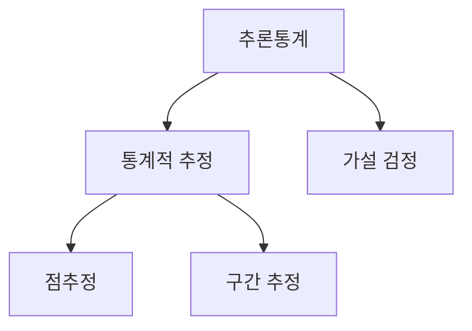

# ◎ 빅데이터분석 기사 필기

## 0. 통계기본


### 기술통계

- 기술통계: 그림을 그리거나 숫자를 찍거나 하는 식으로 데이터에 대해서 요약/정리, 데이터를 기술(describe) 한다
- 모수: 모집단의 평균($\mu$), 분산($\sigma^2$), 표준편차($\sigma$)
- 통계량: 표본의 특성을 나타내는 값  평균($\bar{X}$)), 표준편차(s)
- 확률변수: 모든 경우의 수를 확률적으로 내포하고 있는 수를 확률변수
- 확률분포: 확률변수는 다양한 값을 취할수 있는데, 각각 취할수 있는 값이 서로 또 확률이 다르죠?

### 추론통계

- 추론통계: 표본에서 모집단 방향으로 무엇을 하는것, 모집단의 분포에 대해서 추리하는 것, 모형화(modeling)
- 추론 : 모집단의 모수에 대해서 판단하는 것
- 추정량 : 어떤 포인트를 딱 찍어서 모수(예:평균)을 추정하는것이 점추정인데, 이때 쓰이는 표본평균은 `추정량`이라고 합니다.
  - 내가 선택한 추정량이 좋은 추정량인지 아닌지? 혹은 그 추정량의 특성을 따질때 추정량은 불편성, 일치성, 효율성, 최소분산을 고려하는데요
- 표준오차 : 표본을 통해서 얻은 추정량은 흔들흔들거리기 때문에 변동성이 있습니다. 이런 변동성을 표준오차라고 합니다.
- 통계적 추정 : 모수의 값에 대해서 직접적으로 몇인지를 추정하는 것



### `탐색적` 데이터 분석(Exploratory Data Analysis) vs `확증적` 데이터 분석(Confirmative Data Analysis)

- 데이터 분석가나 연구자가 사전에 세운 가설 유무에 따라
  - 가설 無 : 탐색적 데이터 분석 → 데이터에서 가설 후보를 발견(데이터로 부터 insight를 끄집어 내고 가설후보를 발견해내는 분석)
  - 가설 有 : 확증적 데이터 분석 → 가설이 옳은지 여부를 검증
- 가설(假設 : 거짓 가, 말씀 설) : (모집단에 대한) 주장이나 예측
- 검정(檢定 : 검사할 검, 정할 정) : 타당성을 평가하는 과정

## 1. 빅데이터 분석 기회

### 1) 빅데이터의 이해

#### ● 분석조직의 구조

- 집중구조 : □□□ ■ 중복/이원화 가능성.
- 분산구조 : ▣▣▣  분석인력을 현업부서로 배치.
- 기능구조 : □□□ 별도의 조직이 없고 해당 부서에서 수행.

#### ● 데이터의 품질 기준

- 정확성(Accuracy) : 실제 세계에 존재하는 객체의 표현값이 정확히 반영되어야 함. 
- 완전성(Completeness) : 필수 항목에 누락이 없어야 함.
- 적시성(Timeliness) : 지속적으로 생성 소멸하는 데이터에 대한 품질기준으로 필요로 하는 시점에 맞게 적절하게 제공
- 일관성(Consistency) : 데이터가 지켜야 할 구조, 값, 표현되는 형태가 일관되게 정의되고, 서로 일치 

## 2. 빅데이터 탐색

### 1) 데이터 전처리

### 2) 데이터 탐색

#### ● 통계적 추정(Estimation) vs 가설 검정(Hypothesis Testing)

- `추정` : 표본에서 얻은 정보(통계량)를 바탕으로 미지의 모수(모평균, 모분산 등)를 추츨하는 과정
  - 점추정
  - 구간추정
- `검정` : 모집단에 대한 어떤 주장(가설)이 타당한지 표본데이터를 이용해 표본 통계량으로 검증하는 과정
  - 귀무가설($H_{0}$) 설정 : 차이가 없다. 1인분 = 200g
  - 대립가설($H_{1}$) 설정 : 차이가 있다. 1인분 200g이 아님 
  - 검정통계량 및 p-value 계산 : 표본 기반의 수치 계산
  - 판정 : p-value < 유의 수준(0.05)이면 귀무가설 기각 
  - p-value : 우연히 나왔을(작을) 확률

#### ● 자료의 형태에 따른 자료 분석

| 종속변수 | 독립변수 |               분석방법                |                 사례                  |
| :------: | :------: | :-----------------------------------: | :-----------------------------------: |
|  연속형  |  연속형  |          상관분석, 회귀분석           |                                       |
|  연속형  |  범주형  | t검정(`2그룹`), 분산분석(`2그룹이상`) |        지역별 가계수입의 차이         |
|  범주형  |  연속형  |           로지스틱 회귀분석           |       소득에 따른 결혼의 선호도       |
|  범주형  |  범주형  | 카이제곱 검정, 빈도분석, 로그선형모형 | 지역별 선호정당(`지역별 정당 선호도`) |

#### ● 상관관계 분석

## 📌 1. 공분산(Covariance)

👉 **두 변수가 함께 증가하거나 감소하는 경향(공동 변동성)을 나타내는 값**
👉 핵심은 **“두 변수가 함께 어떻게 변하는가”**를 보는 것입니다 👍

---

## 📌 2. 공식

$Cov(X,Y) = E[(X - \mu_X)(Y - \mu_Y)]$

또는 표본일 때:

$Cov(X,Y) = \frac{1}{n-1} \sum (x_i - \bar{x})(y_i - \bar{y})$

---

## 📌 3. 의미 (핵심🔥)

👉 두 변수의 “움직임 방향”을 알려줌

---

### ✔ 해석

* Cov > 0
  👉 X 증가 → Y도 증가 (양의 관계)

* Cov < 0
  👉 X 증가 → Y 감소 (음의 관계)

* Cov ≈ 0
  👉 관계 없음 (또는 약함)

---

## 📌 4. 직관적 이해

👉 평균 기준으로 생각하면 쉬움

* X가 평균보다 크고 Y도 크다 → (+)
* X가 평균보다 작고 Y도 작다 → (+)
* 서로 반대 → (−)

👉 이런 값들을 모두 더한 것이 공분산

---

## 📌 5. 예시

* 공부시간 ↑, 성적 ↑ → 공분산 > 0
* 가격 ↑, 수요 ↓ → 공분산 < 0

---

## 📌 6. 한계 (시험 중요🔥)

### ❗ 단위에 영향을 받음

👉 값의 크기로 비교가 어려움

---

### ❗ 크기 자체는 의미 없음

👉 방향만 의미 있음

---

## 📌 7. 그래서 나온 것이 상관계수(공분산을 표준화(또는 Z-score정규화) 한것)

👉 공분산을 표준화한 것:

$
r = \frac{Cov(X,Y)}{\sigma_X \sigma_Y}
$

👉 → 단위 제거 + 비교 가능

---

## 📌 8. 핵심 비교

| 구분    | 공분산       | 상관계수    |
| ----- | --------- | ------- |
| 의미    | 함께 변하는 방향 | 방향 + 강도 |
| 범위    | 제한 없음     | -1 ~ 1  |
| 단위 영향 | 있음        | 없음      |

---

## 📌 9. 한 줄 정리

👉 **공분산 = 두 변수의 “함께 움직이는 방향”을 나타내는 값**

---

## 🔥 시험 핵심 요약

✔ 양수 → 같은 방향
✔ 음수 → 반대 방향
✔ 크기 의미 없음
✔ 단위 영향 있음
✔ 상관계수의 기반

---

#### ● 상관관계 검정(Hypothesis Testing:표본 데이터를 기반으로 귀무가설(H0)의 참/거짓을 활률적으로 판정)

- ① 가설 검정 : 두 변수간 선형 관계 H0 없음 ↔ 있음 H1
- ② 검정 통계량(t-통계량) : **"표본 결과가 귀무가설과 얼마나 다른지"를 표준화 해서 나타낸 값**
- ③ 유의성 검정

### 3) 통계기법의 이해

#### ● Z-score(표준점수)

- **"데이터가 평균에서 얼마나 떨어져 있는지를 표준편차 기준으로 나타낸 값"**
- 데이터를 평균 0, 표준편차 1 기준으로 표준화한 값 → 표준정규분포 사용 가능
- 이상치 탐지 : |Z| > 2 → 의심

#### ● 이산형 확률분포

- 베르누이 분포 : `성공/실패 여부`의 확률분포
  - 여러번의 베르누이 시행(1번~10번 문제) → 우리반 학생들 전부 다 시험
- 이항 분포 : `시험 점수 : N회 베르누이 시행후 성공 횟수`의 확률분포(가능성 지도)

- "누포항하"
- 이항분포 평균 E(X) = np : 주사위를 1200회 반복하여 1의눈이 나올 확률  B(1200, 1/6) =1200*1/6=200
- 이항분포 분산 V(X) = np(1-p)

#### ● 연속형 확률분포

##### 👉 학생 한사람의 입장

- 정규 분포 : `총 N→∞ 문제 : 빈틈 없는 값들 : 연속되는 값들`의 확률분포(가능성 지도)
  - 점수의 확률분포(가능성 지도)
- 표준정규 분포 : `표준화된` 빈틈없는 값들의 좌우대칭 종모양인 확률분포(가능성 지도)
  - $\frac{X - \mu}{\sigma}$

##### 👉 담임 선생님의 입장

###### 우리반 시험 평균이 어는 정도인가?

- 시험점수의 평균의 분포
- `n명`의 점수의 **평균** 의 확률분포(가능성지도)
  - n명의 평균 점수 (`n개의 관측값의 표본 평균`) : 반평균(표본 평균)
  - $Z=\frac{\bar{X} - \mu}{\frac{\sigma}{\sqrt{n}}}$
- t 분포 : 표준정규분포의 보정으로 쓰는 확률분포
  - $\sigma$(모표준편차)을 모르기 때문에 표본을 갖고 표준편차를 구한것 s(표본표준편차)
  - $t-분포=\frac{\bar{X} - \mu}{\frac{s}{\sqrt{n}}}$

###### 우리반 유독 들쭉날쭉한 편인가?

- 카이제곱 분포 : `분산`을 표준한 결과의 가능성 지도
- $\chi^2= (n-1)\frac{S^2}{\sigma^2}$

##### 👉 교장선생님의 입장

###### 교장선생님은 학년간 점수 퍼진 정도가 들쭉날쭉한 것 같은데? → 다른학교에 비해서 우리 학교가 유독 이런 편일까?

- F-분포 : 정규분포에서 n개씩 뽑힌 두 집단의 `퍼진 정도(분산)를 서로 나눈 비율`의 확률분포(가능성 지도)
  - 1을 중심으로 높거나/낮거나 한다
- $F-분포=\frac{{S_1^2}/{\sigma_1^2}}{{S_2^2}/{\sigma_2^2}}$

- 정규/지수/t-/카이제곱/F-분포

## 3. 빅데이터 모델링

### 1) 정형데이터 분석기법

#### Ensemble

##### ● 배깅(Bagging)

```
         ┌───┐
         │ S │
         └───┘
      ↗       ↘
┌───┐    ┌───┐  ┌─────┐ 
│raw│ --→│ S │ →│model│ 분산을 줄이고 정확도 향상
└───┘    └───┘  └─────┘
      ↘      ↗
         ┌───┐
bootstrap│ S │voting
         └───┘       
```

##### ● 부스팅(Boosting)

```
       ┌─────┐
       │weak │ 높은 가중치
       └─────┘
     ↗       ↘
┌───┐           ┌─────┐ 
│raw│           │model│ 예측오차 향상
└───┘           └─────┘
      ↘      ↗
       ┌──────┐
       │strong│ 낮은 가중치
       └──────┘
```

##### ● Bagging vs Boosting

|           Bagging            |         Boosting         |
| :--------------------------: | :----------------------: |
|           병렬학습           |        순차적학습        |
|     분산감소(과적합완화)     |  편향감소(예측력 향상)   |
| 샘플링: 부트스트랩(중복허용) | 샘플링: 오류에가중치부여 |
|   다수결(분류)/평균(회귀)    |   가중합으로 성능 개선   |

## 4. 빅데이터 결과해석

### 1) 분석모형 평가 및 개선

#### 분석모형 진단

##### ● 모형진단

###### ① 정규성 가정(데이터가 정규분포를 따르는지 확인하는 검정)

- 샤피로-윌크 검정 : H0 데이터는 정규분포를 따름
- K-S 검정 : H0 두 표본이 같은 분포를 따름
- Q-Q plot : 회귀모형의 가정진단(잔차확인)

#### 모수 유의성 검정

##### ● 모**평균**에 대한 유의성 검정(t-검정)

- t-test : 두 집단의 평균비교에 사용하는 추론 통계 기법
  - 표본이 정규분포를 따른다는 가정 필요 → 정규성 검정 실시(샤피로-윌크, K-S등)

- t-통계량(t-statistic)은 가설검정에서 매우 핵심적인 개념으로,
**“표본 결과가 귀무가설과 얼마나 다른지”를 표준화해서 나타낸 값**입니다 👍

---

## 📌 1. 한 줄 정의

👉 **표본평균이 가설의 평균과 얼마나 차이나는지를 표준오차로 나눈 값**

---

## 📌 2. 기본 공식 (단일 표본 t검정)

$
t = \frac{\bar{x} - \mu}{s/\sqrt{n}}
$

* ( $\bar{x}$ ): 표본평균
* ( $\mu$ ): 가설 평균 (귀무가설)
* ( s ): 표본 표준편차
* ( n ): 표본 크기

---

## 📌 3. 왜 t-통계량을 사용하는가?

👉 모집단의 표준편차(σ)를 모를 때 사용

👉 대신 표본 표준편차(s)를 사용
👉 → 불확실성이 증가 → t분포 사용

---

## 📌 4. 의미 (핵심🔥)

👉 “차이 / 불확실성”

$t = \frac{\text{차이}}{\text{표준오차}}$

---

## 💡 해석

* |t| 값이 크다 → 차이가 크다 → 귀무가설 기각 가능성 ↑
* |t| 값이 작다 → 차이가 작다 → 귀무가설 유지

---

## 📌 5. 예시

* 가설: 평균 = 100
* 표본평균 = 110
* 표준편차 = 20
* 표본크기 = 25

$t = \frac{110 - 100}{20/\sqrt{25}} = \frac{10}{4} = 2.5$

👉 평균보다 꽤 큰 차이 → 유의할 가능성 있음

---

## 📌 6. t분포 특징

👉 정규분포와 비슷하지만:

* 꼬리가 두꺼움 (tail이 큼)
* 표본이 작을수록 더 퍼짐

---

### ✔ 자유도(df)

$df = n - 1$

👉 자유도가 커질수록 → 정규분포에 가까워짐

---

## 📌 7. 언제 사용하는가?

✔ 표본 수가 적을 때
✔ 모집단 분산을 모를 때
✔ 평균 검정 (t-test)

---

## 📌 8. z-통계량과 차이

| 구분   | t-통계량 | z-통계량 |
| ---- | ----- | ----- |
| 분산   | 모름    | 앎     |
| 표본크기 | 작음    | 큼     |
| 분포   | t분포   | 정규분포  |

---

## 📌 9. 시험 핵심 포인트🔥

✔ t = (차이 / 표준오차)
✔ σ 모르면 t 사용
✔ 자유도 = n-1
✔ |t| 크면 기각

---

## 📌 한 줄 정리

👉 **t-통계량 = “평균 차이를 표준오차로 나눈 값 → 가설과의 거리”**

---
---

# 【 통계 기초 】

---
---

## 📌 산술평균, 기하평균, 조화평균

👉 **데이터의 성격(덧셈 / 곱셈 / 비율)**에 따라 적절한 평균이 다릅니다.

---

### 1️⃣ 산술평균 (Arithmetic Mean)

가장 일반적인 평균입니다.

$\bar{x} = \frac{x_1 + x_2 + \cdots + x_n}{n}$

#### ✔ 특징

* 단순 합의 평균
* 이상치(outlier)에 민감

#### ✔ 언제 사용?

👉 **값이 더해지는 구조일 때**

#### ✔ 예시

* 학생 평균 점수
* 월급 평균
* 온도 평균

👉 “총합을 n으로 나누는 게 자연스러운 경우”

---

### 2️⃣ 기하평균 (Geometric Mean)

곱셈 구조에서 사용하는 평균입니다.

$G = (x_1 x_2 \cdots x_n)^{\frac{1}{n}}$

#### ✔ 특징

* 비율/성장률에 적합
* 항상 산술평균보다 작거나 같음

#### ✔ 언제 사용?

👉 **비율이 누적되는 경우 (곱셈 구조)**

#### ✔ 예시

* 투자 수익률
* 인구 증가율
* CAGR(연평균 성장률)

##### 🔹 예 (중요)

+10%, -10% 수익:

* 산술평균: 0% (착각)
* 기하평균: 실제 손실 발생

👉 그래서 금융에서는 반드시 기하평균 사용

---

### 3️⃣ 조화평균 (Harmonic Mean)

“비율의 평균”을 구할 때 사용합니다.
$
H = \frac{n}{\frac{1}{x_1} + \frac{1}{x_2} + \cdots + \frac{1}{x_n}}
$

#### ✔ 특징

* 작은 값의 영향이 큼
* 속도/비율 평균에 적합

#### ✔ 언제 사용?

👉 **“단위당 값” (rate) 평균일 때**

#### ✔ 예시

* 평균 속도
* 단가 평균
* 처리율 (throughput)

##### 🔹 예 (중요)

왕복 속도:

* 갈 때: 60km/h
* 올 때: 40km/h

👉 평균 속도 = 50이 아니라
👉 조화평균 = **48 km/h**

---

### 4️⃣ 세 평균 비교 핵심

| 구분    | 산술평균   | 기하평균     | 조화평균     |
| ----- | ------ | -------- | -------- |
| 구조    | 덧셈     | 곱셈       | 역수       |
| 사용 상황 | 일반 데이터 | 성장률/비율   | 속도/단위당 값 |
| 특징    | 직관적    | 누적 변화 반영 | 작은 값 민감  |
| 관계    | 가장 큼   | 중간       | 가장 작음    |

👉 항상 성립:
$
\text{조화평균} \le \text{기하평균} \le \text{산술평균}
$

---

### 5️⃣ 한 줄로 정리 (시험 핵심)

* 산술평균 → **“더하는 데이터”**
* 기하평균 → **“곱해지는 데이터(성장률)”**
* 조화평균 → **“나눠지는 데이터(속도, 단가)”**

---

#### 🔥 실무 감각 팁

* 금융/수익률 → **기하평균 (거의 필수)**
* 속도/성능 → **조화평균**
* 일반 통계 → **산술평균**

---

확률변수와 확률분포는 확률·통계의 가장 핵심 개념입니다.
👉 한 문장으로 요약하면:

> **확률변수 = 결과를 숫자로 바꾼 것**
> **확률분포 = 그 숫자가 어떻게 나오는지 규칙**

---

### 1️⃣ 확률변수 (Random Variable)

#### ✔ 정의

실험 결과(사건)를 **숫자로 대응시킨 함수**

#### ✔ 직관적 이해

예: 동전 던지기

* 앞면 → 1
* 뒷면 → 0

👉 이 “숫자 부여 규칙”이 바로 확률변수

---

#### ✔ 수학적 표현

확률변수는 보통 (X)로 표현

$
X: \text{표본공간} \rightarrow \mathbb{R}
$

---

#### ✔ 종류

##### (1) 이산확률변수

* 값이 **뚝뚝 끊어짐**
* 셀 수 있음

예:

* 주사위 눈 (1~6)
* 불량품 개수

---

##### (2) 연속확률변수

* 값이 **연속적**
* 구간으로 표현

예:

* 키, 몸무게
* 시간, 온도

---

### 2️⃣ 확률분포 (Probability Distribution)

#### ✔ 정의

확률변수가 **어떤 값을 얼마나 자주 가지는지** 나타낸 것

---

#### ✔ 이산형 확률분포

각 값에 확률을 직접 부여

예:

| X    | 1   | 2   | 3   |
| ---- | --- | --- | --- |
| P(X) | 0.2 | 0.5 | 0.3 |

👉 조건:

* 모든 확률의 합 = 1

---

#### ✔ 연속형 확률분포

확률을 함수로 표현 (확률밀도함수)

중요 특징:

* 특정 값의 확률 = 0
* 구간으로 확률 계산

$
P(a \le X \le b)
$

---

### 3️⃣ 핵심 구성 요소

#### ✔ 확률질량함수 (PMF) – 이산형

$
P(X = x)
$

#### ✔ 확률밀도함수 (PDF) – 연속형

$
f(x)
$

#### ✔ 누적분포함수 (CDF)

$
F(x) = P(X \le x)
$

---

### 4️⃣ 예시로 이해

#### 🎲 주사위 (이산형)

* 확률변수: (X = 주사위 눈)
* 확률분포:

  * 모든 값이 1/6

---

#### 📏 키 (연속형)

* 확률변수: (X = 사람 키)
* 확률분포:

  * 정규분포 형태

---

### 5️⃣ 확률변수 vs 확률분포 차이

| 구분 | 확률변수       | 확률분포      |
| -- | ---------- | --------- |
| 의미 | 결과를 숫자로 표현 | 숫자의 발생 확률 |
| 역할 | 입력         | 규칙        |
| 예  | 주사위 값      | 각 값의 확률   |

👉 쉽게 말하면

* 확률변수 = “값”
* 확률분포 = “그 값의 패턴”

---

### 6️⃣ 중요한 직관

확률분포는 결국:

👉 “데이터가 어떻게 퍼져 있는가”

* 중앙 → 평균
* 퍼짐 → 분산
* 형태 → 분포

---

### 7️⃣ 한 줄 정리

* 확률변수: **결과를 숫자로 만든 것**
* 확률분포: **그 숫자의 등장 규칙**

---

## 📌 1. 오즈 (Odds)

👉 **어떤 사건이 일어날 가능성과 일어나지 않을 가능성의 비율**

---

### ✔ 정의

Odds = $\frac{P}{1 - P}$

* ( P ): 사건이 일어날 확률

---

### ✔ 예시

어떤 사건이 일어날 확률이 0.8이면:

Odds = $\frac{0.8}{0.2}$ = 4

👉 의미:
**“일어날 가능성이 안 일어날 가능성보다 4배 높다”**

---

## 📌 2. 오즈비 (Odds Ratio, OR)

👉 **두 집단의 오즈를 비교한 값**

---

### ✔ 정의

OR = $\frac{Odds_1}{Odds_2}$

---

### ✔ 예시

* 그룹 A: 확률 0.8 → 오즈 = 4
* 그룹 B: 확률 0.5 → 오즈 = 1

OR = $\frac{4}{1}$ = 4

👉 의미:
**A 집단이 B 집단보다 사건 발생 가능성이 4배 더 큼**

---

## 📌 3. 핵심 차이

| 구분 | 오즈           | 오즈비         |
| ---- | -------------- | -------------- |
| 의미 | 한 사건의 비율 | 두 집단 비교   |
| 개수 | 1개 값         | 2개 비교       |
| 사용 | 확률 변환      | 효과 크기 비교 |

---

## 📌 4. 직관적 이해 (중요🔥)

👉 오즈 = “내부 비율”
👉 오즈비 = “집단 간 비교”

---

## 📌 5. 로지스틱 회귀와의 관계

로지스틱 회귀에서는:

$\log(Odds)$ = $\beta_0$ + $\beta_1$x

👉 여기서 중요한 해석:

* ( $e^{\beta_1}$ ) = **오즈비(OR)**

---

### ✔ 해석

* ( $e^{\beta_1}$ > 1 ) → 증가
* ( $e^{\beta_1}$ < 1 ) → 감소

---

## 📌 6. 시험 핵심 포인트🔥

✔ 오즈 = ( P / (1-P) )
✔ 오즈비 = 오즈의 비율
✔ 로지스틱 회귀 → 계수 지수화 = OR
✔ OR = 1 → 차이 없음

---

## 📌 한 줄 정리

👉 **오즈는 “확률의 형태”, 오즈비는 “두 집단 비교 지표”**

---

---

## 🧠 *카이제곱 검정(Chi-square test)**

👉 **범주형 데이터에서 “차이” 또는 “관계”가 있는지 확인할 때** 사용하는 통계 방법입니다.
👉 **카이제곱 검정 = “범주형 데이터에서 기대값과 실제값 차이를 통해 관계/차이를 검정하는 방법”**

---

## 📌 1. 언제 사용하는가? (핵심 요약)

👉 아래 3가지 상황에서 사용합니다:

### ✔ 1️⃣ 적합도 검정 (Goodness-of-Fit)

* “데이터가 **이론적 분포와 맞는가?**”

예:

* 주사위가 공정한가?
* 고객 비율이 예상(남50%, 여50%)과 같은가?

---

### ✔ 2️⃣ 독립성 검정 (Independence Test)

* “두 변수 사이에 **관계가 있는가?**”

예:

* 성별 ↔ 제품 구매 여부
* 흡연 여부 ↔ 질병 발생

👉 가장 많이 사용되는 형태

---

### ✔ 3️⃣ 동질성 검정 (Homogeneity Test)

* “여러 집단의 분포가 **같은가?**”

예:

* 지역별 고객 선호 차이
* 연령대별 브랜드 선호

---

## 📊 2. 핵심 아이디어

👉 관측값 vs 기대값 비교

* 실제 데이터 (관측도수)
* 이론적으로 기대되는 값 (기대도수)

👉 차이가 크면 → **유의함 (관계 있음)**

---

## 📐 3. 검정통계량

$\chi^2$ = $\sum \frac{(O - E)^2}{E}$

* (O): 관측값
* (E): 기대값

👉 차이가 클수록 χ² 값 증가 → 유의성 증가

---

## 📊 4. 예시로 이해

### ✔ 예: 성별 vs 구매 여부

|      | 구매 | 미구매 |
| ---- | ---- | ------ |
| 남성 | 40   | 60     |
| 여성 | 70   | 30     |

👉 질문:

* 성별에 따라 구매 차이가 있는가?

👉 카이제곱 검정 사용

---

## ⚠️ 5. 사용 조건 (중요)

### ✔ 반드시 범주형 데이터

* O (연속형 데이터 ❌)

---

### ✔ 기대도수 조건

* 각 셀의 기대값 ≥ 5 권장

👉 너무 작으면:

* Fisher's Exact Test 사용

---

## ❌ 6. 사용하면 안 되는 경우

* 평균 비교 → ❌ (t-test 사용)
* 연속형 데이터 → ❌
* 표본이 너무 작음 → ❌

---

## 📊 7. 한눈에 정리

| 목적              | 사용 여부 |
| ----------------- | --------- |
| 범주 간 관계 확인 | ✅         |
| 분포 적합성 확인  | ✅         |
| 평균 비교         | ❌         |
| 수치 예측         | ❌         |

---

## 📌 1. 기본 개념

### ✔ 모수 유의성 검정

모수(모집단의 평균, 비율 등)에 대해 **유의성 검정**을 한다는 것은
👉 “표본에서 얻은 결과가 **우연인지, 실제로 의미 있는 차이인지**”를 판단하는 과정입니다.

### ✔ 모수 유의성 검정의 목적

* 모집단의 특성(모수)이 특정 값과 같은지 검증
* 예:

  * 평균이 100인가?
  * 비율이 0.5인가?

---

## 📊 2. 검정 절차 (핵심 5단계)

### ① 가설 설정

* **귀무가설(H₀)**: 변화 없음 / 차이 없음
* **대립가설(H₁)**: 변화 있음 / 차이 있음

예:

* H₀: μ = 100
* H₁: μ ≠ 100

---

### ② 유의수준 설정 (α)

* 보통 0.05 사용
* 의미: “5% 확률로 틀릴 것을 감수”

---

### ③ 검정통계량 계산

대표적으로:

#### ✔ 평균 검정 (t-검정)

$t = \frac{\bar{x} - \mu_0}{s / \sqrt{n}}$

* ( $\bar{x}$ ): 표본평균
* ( $\mu_0$ ): 가설 평균
* ( s ): 표본 표준편차
* ( n ): 표본 크기

---

### ④ p-value 또는 임계값 비교

#### 방법 1: p-value

* p-value < α → **귀무가설 기각**

#### 방법 2: 임계값

* |t| > t(임계값) → **기각**

---

### ⑤ 결론

* 귀무가설 기각 → “유의하다”
* 기각 못함 → “유의하지 않다”

---

## 📌 3. 대표적인 검정 종류

### 1️⃣ 평균 검정

* 1표본 t-test
* 2표본 t-test

👉 예: “이 제품 평균 수명이 10년인가?”

---

### 2️⃣ 비율 검정

* z-test 사용

👉 예: “불량률이 5%인가?”

---

### 3️⃣ 분산 검정

* F-test

👉 예: “두 집단의 변동성이 같은가?”

---

## 📊 4. 직관적인 이해

👉 핵심 아이디어는 이것입니다:

> “이 정도 차이가 **우연으로 발생할 확률이 얼마나 되냐?**”

* 확률이 매우 작다 → 우연 아님 → **유의함**
* 확률이 크다 → 우연 가능 → **유의하지 않음**

---

## ⚠️ 5. 자주 하는 오해

### ❌ p-value = 정답 확률

👉 아님
→ “귀무가설이 맞을 때 이런 결과가 나올 확률”

---

### ❌ 유의하다 = 중요하다

👉 아님
→ 통계적으로 의미 있을 뿐, 실제 영향은 작을 수 있음

---

## 🧠 한 줄 정리

👉 **모수 유의성 검정 = “표본 결과가 우연인지 아닌지 확률로 판단하는 과정”**

---

1. F-검정 :  두 집단 **분산 차이** 검정
- $F = \frac{S_{1}^2}{S_{2}^2}$
- 두 집단의 분산 비율($S_{1}^2$ / $S_{2}^2$ )로 계산

2. 합동분산 추정량


- $
S_{p}^2 = \frac{(n_{1}-1)S_{1}^2 + (n_{2}-1)S_{2}^2 }{(n_{1}+n_{2}-2)}
$

3. 독립표본 t-검정


$t = \frac{\bar{x_{1}} - \bar{x_{2}}}{S_{p}\sqrt{\frac{1}{n_{1}}+\frac{1}{n_{2}}}}$
