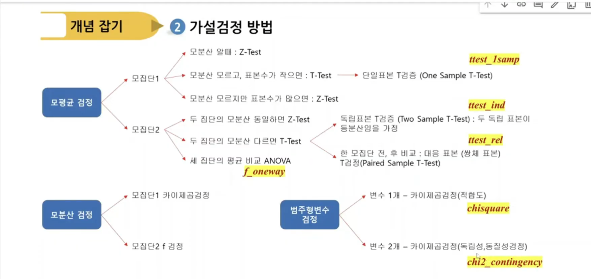

# ◎ 빅데이터분석 기사 실기

## 기출 패턴

### 📊 제1 유형

#### 1️⃣  IQR 기반 이상치

```python
Q1 = df['col'].quantile(0.25)
Q3 = df['col'].quantile(0.75)

IQR = Q3-Q1

lower = Q1 - 1.5 * IQR
upper = Q2 + 1.5 * IQR

# 이상치 갯수
outliers = df[(df['col'] < lower) | (df['col'] > upper)]
len(outliers)

# Z score 기반 이상치 갯수
mean_val = df['col'].mean()
std_val  = df['col'].std()
df['z'] = (df['col'] - mean_val) / std_val
outliers = df[(df['z'] > 1.5) | (df['z'] < -1.5)]

```

#### 2️⃣ 결측치 처리(대체/제거)

```python
# 결측치가 많은 컬럼 최빈값 대체
freq = df['col'].mode()[0]
df= df.fillna(freq)

df= df.dropna(subset=['col']) #특정열의 결측치만 제거
```

#### 3️⃣ 문자열 처리

```python
# 특수문자 제거
dat['conventional'] = dat['conventional'].replace(r'[^a-zA-Z0-9가-힣]',np.nan,regex=True)

# 서울시 OO구
df['GUGU'] = df['STATION_ADDR1'].str.extract(r'([가-힣]+구)')
```

#### 4️⃣ 날짜/시간 데이터 처리

```python
#문자열 → 날짜 전환
df['date'] = pd.to_datetime[df['date']]
# 분리되어 있는것을  합쳐서 → 날짜 전환
df['date'] = pd.to_datetime(dict(year=df.year, month=df.month, day=df.day))

# 년/월/일/요일 추출
df['year'] = df['date'].dt.year
df['month'] = df['date'].dt.month
df['day'] = df['date'].dt.day
df['weekday'] = df['date'].dt.dayofweek # 0이 월요일
```

#### 5️⃣ 그룹 집계

```python
sumdf= df.groupby(['year','지역코드','gender'])['tot'].sum()
pivot_table = sumdf.unstack(fill_value=0) # gender가 컬럼이 됨
max_code = pivot_table['abs'].idxmax()
```

#### 6️⃣ 데이터 스케일링 (표준화/정규화)

```python
# Min-Max 정규화
from sklearn.preprocessing import MinMaxScaler
scaler = MinMaxScaler()
df['col'] = scaler.fit_transform(df['col'])

# 표준화
from sklearn.preprocessing import StandardScaler
scaler = StandardScaler()
df['col'] = scaler.fit_transform(df['col'])
```

#### 7️⃣ 파생변수 생성 + 조건계산

```python
df['grade'] = np.where(df['score'] >= 80, 'Pass', 'Fail')
df['취소유무'] = np.where(df['주문번호'].str[0] == 'C', '취소','주문')

# Target 컬럼이 문자열일 경우  숫자형으로 변형하는것이 좋다'
train['Attrition_Flag'] = train['Attrition_Flag'].map({'Existing Customer': 0, 'Attrited Customer':1})
```

## 📊 제2 유형

### 평가 지표별 코드와 주의 사항

- ROC-AUC 평가지표일때는 predict()가 아니라 predict_proba()[:,1]을 사용해야 한다

| 평가지표 | 유형 | 코드                                     | 방향                |
| -------- | ---- | ---------------------------------------- | ------------------- |
| Accuracy | 분류 | accuracy_score(y_val, y_pred)            | 1에 가까울수록 좋음 |
| Macro F1 | 분류 | f1_score(y_val, y_pred, average='macro') | 1에 가까울수록 좋음 |
| ROC-AUC  | 분류 | roc_auc_score(y_val, y_pred_proba)       | 1에 가까울수록 좋음 |
| RMSE     | 회귀 | root_mean_squared_error(y_val, y_pred)   | 0에 가까울수록 좋음 |
| R2       | 회귀 | r2_score(y_val, y_pred)                  | 1에 가까울수록 좋음 |

### 모델 성능 향상

```python
# stratify는 소수 클래스이 데이터가 특정 셍(Train 또는 Test)에 몰리거나 빠지는 현상을 막아줌
X_train, X_test, y_train, y_test = train_test_split(X, y, test_size=0.2, random_state=42, stratify=y)

from sklearn.ensemble import RandomForestClassifier

model = RandomForestClassifier(n_estimators=500,class_weight='balanced',random_state=42)

```

## 📊 제3 유형

### 가설검정 유형



| 유형                 |    핵심함수     |                     치트키                     |
| -------------------- | :-------------: | :--------------------------------------------: |
| 1. 독립표본 T검정    |   ttest_ind()   |          A그룹 vs B그룹, 남자 vs 여자          |
| 2. 대응표본 T검정    |   ttest_rel()   |      다이어트 전후, 교육 전후, 투약 전후       |
| 3. 단일표본 T검정    |  ttest_1samp()  |       평균이 OO인지 검정, 기준값과 비교        |
| 4. 카이제곱 적합도   |   chisquare()   |        동일한 비율인지, 기대빈도와 비교        |
| 5. 카이제곱 독립성   | chi2_contigency | 성별과 생존여부의 관련성, 연령대와 선호도 차이 |
| 6. 일원배치 분산분석 |    f_oneway     |            3개그룹 차이, A/B/C 비교            |

- 독립표본 T검정 - 등분산 검정 (소문제)

```python
stat, p = stats.levene(group_a, group_b)
# p > 0.05 등분산(분산이 같음)

# 등분산 가정
stat, p = stats.ttest_ind(group_a, group_b, equal_var=True)

# 등분산이 아닐때
stat, p = stats.ttest_ind(group_a, group_b, equal_var=False)
```

- 단일표본 T검정

```python
stat, p = stats.ttest_1samp(df['col'], popmean=50, alternative='greater')
```

- 기타 검정
  - 부호 순위 검정 : wilcoxon
  - K-S 검정 : kstest

- 상관관계

```python
from scipy.stats import pearsonr
```

### 분류 모델 검증

```python
from sklearn.metircs import roc_auc_score, accurcy_score, precision_score, recall_score
accuracy = accuracy_score(y, y_pred)  # 정확도 (TP+TN)/(TP+TN+FP+FN)
precision = precision_score(y, y_pred) # 정밀도 (TP/TP+FP)
recll = recall_score(y, y_pred) # 재현율= 민감도 (TP/TP+FN)
f1 = f1_score(y, y_pred)
auc = roc_auc_score(y,y_pred_proba)
```
---

## 📊 제1 유형

### 4️⃣ 1유형 체험 환경문제('24년)

> 제공된 데이터의 qsec칼럼을 `최소-최대 척도(Min-Max Scale)`로 변환한 후 0.5보다 큰값을 가지는 레코드 수를 [제출 형식]에 맞춰 답안 작성 페이지에 입력하시오

#### 어댑터 풀이

```python

import pandas as pd

df = pd.read_csv("data/mtcars.csv")

print(df.info())

from sklearn.preprocessing import MinMaxScaler
scaler = MinMaxScaler()

df['qsec'] = scaler.fit_trasform(df[['qsec']])

print(len(df[df['qsec'] > 0.5]))


#import sklearn
#help, dir!!!!!!

print(help(sklearn))  # 긁어서   마우스 오른쪽 눌러서 붙어 넣어야 함
print(dir(sklearn.preprocessing))
print(help(MinMaxScaler))

scaler = MinMaxScaler()
scaler.fit(df[['qsec']])
df['qsec']= scaler.transform(df[['qsec']])

print(len(df[df['qsec'] > 05]))

x- min / (max-min) #min-max scaler

print((df['qsec'] - min(df['qsec']))  / (max(df['qsec']) - min(df['qsec'])))

```

### 4️⃣ **(체험) 제1유형 (풀이용)**('25년)

제공된 데이터(`employee_performance.csv`)는 회사의 직원 연봉과 근속 연수 등에 관한 자료이다. 아래 수행 순서에 따라 데이터를 처리한 후, 구한 답을 소문항별로 【제출 형식】에 맞춰 답안 제출 페이지에 답안을 입력하시오.

#### **[제공 데이터]**
- **직원ID:** 고유 식별자
- **부서:** 소속 부서
- **연봉:** 연간 급여
- **근속연수:** 총 근무기간
- **성과등급:** 성과 등급 [A, B, C]
- **교육참여횟수:** 회사 교육에 참여한 횟수
- **고객만족도:** 담당 업무에 대한 고객의 만족도

#### **[수행 순서]**
1) 고객만족도가 없는 직원의 경우, 평균 고객만족도로 결측치를 채운다.
2) 근속연수가 없는 직원의 경우, 해당 직원을 삭제한다.
3) 직원의 고객만족도의 4분위 중 3사분위수 값을 계산한다.
4) 부서별로 평균연봉을 구하고, 두 번째로 평균연봉이 높은 부서의 평균연봉을 계산한다.

---

**① 수행순서 3)에서 계산한 값을 입력하시오.**  
☞ 【제출 형식】 버림하여 정수(integer)로 작성

**② 수행순서 4)에서 계산한 값을 입력하시오.**  
☞ 【제출 형식】 버림하여 정수(integer)로 작성

#### 어댑터 풀이

```python

import pandas as pd

df = pd.read_csv("data/employee_performance.csv")

#print(df.info())

# 1번
mean_satfsfaction = df['고객만족도'].mean()
df['고객만족도'] = df['고객만족도'].fillna(mean_satfsfaction)
print(df.isnull().sum())

# 2번
df = df.dropna(subset=['근속연수'])

#print(help(df.dropna)) #subset 이 기억이 안날때

print(df.isnull().sum())

# 3번
quantile_3 = df['고객만족도'].quantile(0.75)
#print(dir(df))  #quantile 함수가 기억이 안날때
print(int(quantile_3))

```

## 📊 제2 유형

### 4️⃣ 체험환경문제('24년)

> 제공된 데이터는 백화점 고객이 1년간 상품을 구매한 속성 데이터이다, 제공되 학습용 데이터(data/customer_train.csv)를 이용하여 백화점 구매 고객의 성별을 예측하는 모델을 개발하고, 개발한 모델에 기반하여 평가용 데이터(data/customer_test.csv)에 적용하여 얻은 성별 예측결과를 아래[제출형식]에 따라 CSV파일로 생성하여 제출하시오
> 예측 결과는 ROC-AUC 평가지표에 따라 평가함
> 성능이 우수한 예측모델을 구축하기 위해서는 데이터 정제, Feature Engineering, 하이퍼 파라미터(hyper parameter) 최적화, 모델비교등이 필요할수 있음, 다만 과적합에 유의하여야 함.

```python
import pandas as pd

train = pd.read_csv("data/customer_train.csv")
test = pd.read_csv("data/customer_test.csv")

# 1. 데이터 유형 파악
print(train.info())
print(test.info())

# 2. 전처리
#(1) X. Y. train/test set 분리
X_train = train.drop(['회원ID', '성별'], axis=1)
y = train['성별']
X_test = test.drop(['회원ID'], axis=1)

print(X_train.shape, y.shape, X_test.shape)

#(2) 결측치 저리
X_train['환불금액'] = X_train['환불금액'].fillna(0)
X_test['환불금액'] = X_test['환불금액'].fillna(0)

#print(X_train.isna().sum())
#print(X_test.isna().sum())


#(3) 수치형 변수 스케일링
from sklearn.preprocessing import StandardScaler
scaler = StandardScaler()

#X_train[["총구매액", "최대구매액"....]]
num_columns = X_train.select_dtypes(exclude='object').columns

#print(num_columns)
X_train[num_columns] = scaler.fit_transform(X_train[num_columns])
X_test[num_columns] = scaler.transform(X_test[num_columns])  # test는 transform이 중요

#(4) 범주형 변수 인코딩
#train : 피자 치킨 콜라 사이다 → 0 1 2 3
#test : 피자 치킨 콜라 사이다 맥주 → 0 1 2 3 4
#print(set(X_test['주구매상품']) - set(X_train['주구매상품']))
#print(set(X_test['주구매지점']) - set(X_train['주구매지점']))

from sklearn.preprocessing import LabelEncoder
encoder = LabelEncoder()

#train : A B C D E → 0 1 2 3 4 (fit_transform)
#test : A B D E →  0 1 3 4(transform)  0 1 2 3(fit_transform)

X_train['주구매상품'] = encoder.fit_transform(X_train['주구매상품'])
X_test['주구매상품'] = encoder.transform(X_test['주구매상품'])  # test는 transform이 중요
X_train['주구매지점'] = encoder.fit_transform(X_train['주구매지점'])
X_test['주구매지점'] = encoder.transform(X_test['주구매지점'])  # test는 transform이 중요

#3. 데이터 분리
from sklearn.model_selection import train_test_split
X_train, X_val, y_train, y_val = train_test_split(X_train, y, test_size=0.2, stratify=y) # stratify 층화 추출(남자/여자)
print(X_train.shape, X_val.shape, y_train, y_val.shape)

#4. 모델 학습 및 검증
from sklearn.ensemble import RandomForestClassifier
model = RandomForestClassifier()
model.fit(X_train. y_train)
y_val_pred = model.predict(X_val)

# 5. 평가
from sklearn.metrics import roc_auc_score, accuracy_score
auc_score = roc_auc_score(y_val, y_val_pred)
acc = accuracy_score(y_val, y_val_pred)
print(auc_score, acc)

#6 결과저장
y_pred = model.predict(X_test)
result = pd.DataFrame(y_pred, columns=['pred'])
result.to_csv('result.csv', index=False) # index= true는 2차원 배열이 만들어짐으로 반드시 false

# 7. 생성 결과 확인
result = pd.read_csv('result.csv')
print(result)

##################
# 2. 전처리
#(1) X. Y. train/test set 분리
x = train.drop(['성별'], axis=1)
y = train['성별']

X_full = pd.concat([X, test], axis=0)
X_full = X_full.drop(['회원ID'], axis=1)

#print(X_full.shape)

#(2) 결측치 저리
X_full['환불금액'] = X_full['환불금액'].fillna(0)

#(3) 수치형 변수 스케일링 SKIP   랜덤 포레스트 크게 영향을 미치지 않늗다

#(4) 범주형 변수 인코딩
X_full = pd.get_dummies(X_full) #get_dummies 범주형 변수만 알아서 one-hot 인코딩을 함
#print(X_full.shape)
#print(X_full)

#3. 데이터 분리
X_train = X_full[:train.shape[0]]  #train.shape[0] 3500
X_test = X_full[:train.shape[0]:]  
#print(X_train.shape, X_test.shape)

from sklearn.model_selection import train_test_split
X_train, X_val, y_train, y_val = train_test_split(X_train, y, test_size=0.2)
#print(X_train.shape, X_val.shape, y_train, y_val.shape)

#4. 모델 학습 및 검증
from sklearn.ensemble import RandomForestClassifier # 분류문제면 RandomForestClassifier사용
model = RandomForestClassifier()
model.fit(X_train. y_train)
y_val_pred = model.predict(X_val)

# 5. 평가
from sklearn.metrics import roc_auc_score, accuracy_score
auc_score = roc_auc_score(y_val, y_val_pred)
acc = accuracy_score(y_val, y_val_pred)
print(auc_score, acc)

#6 결과저장
y_pred = model.predict(X_test)
result = pd.DataFrame(y_pred, columns=['pred'])
result.to_csv('result.csv', index=False) # index= true는 2차원 배열이 만들어짐으로 반드시 false

# 7. 생성 결과 확인
result = pd.read_csv('result.csv')
print(result)


## 다중분류일때는?
LabelEncoder → A B C D E → 0 1 2 3 4
0 1 2 3 4 → A B C D E (inverse_transform)

```

### 4️⃣ 체험환경문제('25년)

```python

import pandas as pd

train = pd.read_csv("data/customer_train.csv")
test = pd.read_csv("data/customer_test.csv")

#print(df.info())

# 1. 데이터 유형 파악
#print(train.info())
#print(test.info())

# 2. 전처리
#(1) X. Y. train/test set 분리
# 회원ID 일련번호 임으로 과적합 우려
X_train = train.drop(['회원ID', '총구매액'], axis=1)
y = train['총구매액']
X_test = test.drop(['회원ID'], axis=1)

print(X_train.shape, y.shape, X_test.shape)

#(2) 결측치 저리
X_train['환불금액'] = X_train['환불금액'].fillna(0)
X_test['환불금액'] = X_test['환불금액'].fillna(0)

#print(X_train.isna().sum())
#print(X_test.isna().sum())

#(3) 수치형 변수 스케일링
from sklearn.preprocessing import MinMaxScaler
#import sklearn
#print(dir(sklearn.preprocessing))
scaler = MinMaxScaler()
num_columns = X_train.select_dtypes(exclude='object').columns
#print(num_columns)
X_train[num_columns] = scaler.fit_transform(X_train[num_columns])
X_test[num_columns] = scaler.transform(X_test[num_columns])  # test는 transform이 중요

#(4) 범주형 변수 인코딩
#train : 피자 치킨 콜라 사이다 → 0 1 2 3
#test : 피자 치킨 콜라 사이다 맥주 → 0 1 2 3 4
#print(set(X_test['주구매상품']) - set(X_train['주구매상품']))
#print(set(X_test['주구매지점']) - set(X_train['주구매지점']))

from sklearn.preprocessing import LabelEncoder
encoder = LabelEncoder()

#train : A B C D E → 0 1 2 3 4 (fit_transform)
#test : A B D E →  0 1 3 4(transform)  0 1 2 3(fit_transform)

X_train['주구매상품'] = encoder.fit_transform(X_train['주구매상품'])
X_test['주구매상품'] = encoder.transform(X_test['주구매상품'])  # test는 transform이 중요
X_train['주구매지점'] = encoder.fit_transform(X_train['주구매지점'])
X_test['주구매지점'] = encoder.transform(X_test['주구매지점'])  # test는 transform이 중요

#3. 데이터 분리
from sklearn.model_selection import train_test_split
X_train, X_val, y_train, y_val = train_test_split(X_train, y, test_size=0.2)
print(X_train.shape, X_val.shape, y_train, y_val.shape)

#4. 모델 학습 및 검증
from sklearn.ensemble import RandomForestRegressor
model = RandomForestRegressor()
model.fit(X_train. y_train)
y_val_pred = model.predict(X_val)

# 5. 평가
from sklearn.metrics import root_mean_squared_error, r2_score
rmse = root_mean_squared_error(y_val, y_val_pred)
r2 = r2_score(y_val, y_val_pred)
print(rmse, r2)

#6 결과저장
y_pred = model.predict(X_test)
result = pd.DataFrame(y_pred, columns=['pred'])
result.to_csv('result.csv', index=False)

# 7. 생성 결과 확인
result = pd.read_csv('result.csv')
print(result)

########################

# 2. 전처리
#(1) X. Y. train/test set 분리
x = train.drop(['총구매액'], axis=1)
y = train['총구매액']

X_full = pd.concat([X, test], axis=0)
X_full = X_full.drop(['회원ID'], axis=1)

#print(X_full.shape)

#(2) 결측치 저리
X_full['환불금액'] = X_full['환불금액'].fillna(0)

#(3) 수치형 변수 스케일링 SKIP   랜덤 포레스트 크게 영향을 미치지 않늗다

#(4) 범주형 변수 인코딩
X_full = pd.get_dummies(X_full) #get_dummies 범주형 변수만 알아서 one-hot 인코딩을 함
#print(X_full.shape)
#print(X_full)

#3. 데이터 분리
X_train = X_full[:train.shape[0]]  #train.shape[0] 3500
X_test = X_full[:train.shape[0]:]  
#print(X_train.shape, X_test.shape)

from sklearn.model_selection import train_test_split
X_train, X_val, y_train, y_val = train_test_split(X_train, y, test_size=0.2)
#print(X_train.shape, X_val.shape, y_train, y_val.shape)

#4. 모델 학습 및 검증
from sklearn.ensemble import RandomForestRegressor # 분류문제면 RandomForestClassifier사용
model = RandomForestRegressor()
model.fit(X_train. y_train)
y_val_pred = model.predict(X_val)

# 5. 평가
from sklearn.metrics import root_mean_squared_error, r2_score
rmse = root_mean_squared_error(y_val, y_val_pred)
r2 = r2_score(y_val, y_val_pred)
print(rmse, r2)

#6 결과저장
y_pred = model.predict(X_test)
result = pd.DataFrame(y_pred, columns=['pred'])
result.to_csv('result.csv', index=False)

# 7. 생성 결과 확인
result = pd.read_csv('result.csv')
print(result)

```

## 📊 제3 유형

1. F-검정 :  두 집단 **분산 차이** 검정
   
- $F = \frac{S_{1}^2}{S_{2}^2}$
- 두 집단의 분산 비율($S_{1}^2$ / $S_{2}^2$ )로 계산

2. 합동분산 추정량


- P는 pooled variance
- 두 집단의 자유도 분에다가 각집단의 자유도에 가중치를 두어서 분산을 구해주면 된다

- $
S_{p}^2 = \frac{(n_{1}-1)S_{1}^2 + (n_{2}-1)S_{2}^2 }{(n_{1}+n_{2}-2)}
$

3. 독립표본 t-검정


$t = \frac{\bar{x_{1}} - \bar{x_{2}}}{S_{p}\sqrt{\frac{1}{n_{1}}+\frac{1}{n_{2}}}}$

- ttest_ind : 독립검정  함수  scipy

### 4️⃣ 체험환경문제('24년)

> 제공된 데이터(data/Titanic.csv)는 타이타닉호의 침몰사건에서 생존한 승객 및 사망한 승객의 정보를 포함한 자료이다. 아래 데이터를 이용하여 생존 여부(Survived)를 예측하고자 한다. 각문항의 답을[제출형식]에 맞춰 답안 작성 페이지에 입력하시오.(단, 벌점화(penalty)는 부여하지 않는다)

```python

import pandas as pd

df = pd.read_csv("data/Titanic.csv")

# 1번 문제
# ttest 단일 표본 : ttest_1samp, ttest 2변수 독립표본 : ttest_ind, ttest  대응표본 : ttest_rel,  수치형 대아터에 대하여 카이 제곱 통계량 chisquare
from scipy.stats import chi2_contingency, ttest_1samp, ttest_ind, ttest_rel, chisquare
table = pd.crosstab(df['Gender'], df['Survived']) # 교차표가 만들어지고 table에 받아온다
#statistics, p, df, expected = chi2_contigency(table) # 교차표만 집어넣으면 가설검증을 알아서 한다
print(chi2_contigency(table) )

########## 문제푸는 방법
print(chi2_contigency(table)) 

# 2번 문제
# Gender, SibSp, Parch, Fare를 독립변수로 사용하여 로지스틱 회귀모형을 실시하였을때 Parch변수의 계수값은?(반올림하여 소수 세째자리까지 계산)
from statsmodel.api import Logit
from sklearn.preprocessing import LabelEncoder
import statsmodels.api as sm # 모델에 절편을 추가 해야 한다.

encoder = LabelEncoder()
df['Gender'] = encoder.fit_transform(df['Gender'])

X = df[['Gender', 'SibSp', 'Parch', 'Fare']]
X = sm.add_constant(X) # 모델에 절편을 추가 해야 한다.
y = df['Survived']

model = Logit(y, X)
results = model.fit()
print(results.summary())

########## 다른 방법 (절편 및 범주형변수(Gender)를 고려하지 않아도 된다.)

formula = "Survived ~ Gender + SibSp + Parch + Fare"
results = Logit.from_formula(formula, df).fit()
print(results.summary())
print(round(results.params['Parch'], 3))

# 로짓회귀가 아닌, 선형 회귀시
# from statsmodel.api import OLS

# 3번 문제
# 위 2번 문제에서 추정된 로지스틱 회귀모형에서  SibSp  변수가 한 단위 증가할때 생존할 오즈비(Odds ratio)  값은?(반올림하여 소수 세째자리까지 계산)
# 오즈비는 SibSp의 계수 -0.3539 에  exponential 만 하면 된다.  exponential은 numpy에 있다

import numpy as np
print(round(np.exp(results.params['SibSp']), 3)
print(round(np.exp(-0.3539), 3)

```

### 4️⃣ 체험환경문제('25년)

```python

import pandas as pd
import numpy as np
from scipy import stats

df = pd.read_csv("data/bcc.csv")

# 1번 문제
df['log_resistin'] = np.log(df['Resistin'])

group1 = df[df['Classification'] == 1]['log_resistin']
group2 = df[df['Classification'] == 2]['log_resistin']

var1 = group1.var()
var2 = group2.var()

dof_1 = len(group1)-1
dof_2 = len(group2)-1

print(dof_1, dof_2)

f_stat = var2/var1
print(round(f_stat, 3))

#  numpy로 분산을 가져오면,  샘플에 관한것이라서 자유도 1을 빼주어야 한다.
# var1 = np.var(group1, ddof=1)
# var2 = np.var(group2, ddof=1)

# f= 1.348 :f 통계량의 값이 1에 가까우면  2 분산이 차이가 나지 않는다  비슷하다

# 2번 문제
# n1-1이 자유도, n2-1이 자유도라서   전체 자유도는 n1+n2-2
n1 = len(group1)
n2 = len(group2)

pooled_var = ((n1-1)*var1 + (n2-1)*var2)) / (n1+n2-2)

print(round(pooled_var, 3))  # 0.449

# 3번 문제
mean1 = group1.mean()
mean2 = group2.mean()

t_stat = (mean1-mean2)/ np.sqrt(pooled_var*(1/n1+1/n2))

# 누적 밀도 함수  cdf 면적에 대한 적분
# import
# cdf 는 from scipy import stats에 있음
# 2는 양측검정,  p-value 는 1-, stst.t.cdf는 누적밀도
p_value = 2*(1-stat.t.cdf(abs(t_stat), df=n1+n2-2))
print(round(p_value,3))

####
#ttest_result = stats.ttest_ind(group1, group2, equal_var=True)
#print(ttest_result)


## 대응표본
ttest_rel
ttest_1samp

```

## 📊 기타(기본 명령어)

### 👉 상위 10개(TOP 10) 가져오는 방법

#### 1. `head()` — 상위 N행 가져오기

```python
df.head(10)
```
데이터프레임의 **처음 10행**을 그대로 반환합니다.

---

#### 2. `nlargest()` — 특정 컬럼 기준 상위 10개

```python
df.nlargest(10, '컬럼명')
```
지정한 컬럼의 값이 **큰 순서대로** 10개 행을 반환합니다.

```python
# 예시: 매출 상위 10개 상품
df.nlargest(10, 'sales')
```

---

#### 3. `sort_values()` + `head()` — 정렬 후 상위 10개

```python
df.sort_values('컬럼명', ascending=False).head(10)
```
`nlargest()`와 결과는 같지만, **여러 컬럼으로 정렬**할 때 유용합니다.

```python
# 예시: 매출 내림차순 → 같으면 수량 내림차순
df.sort_values(['sales', 'quantity'], ascending=[False, False]).head(10)
```

---

#### 4. `value_counts()` + `head()` — 빈도 기준 상위 10개

```python
df['컬럼명'].value_counts().head(10)
```
카테고리형 데이터에서 **가장 많이 등장하는 값** 상위 10개를 반환합니다.

```python
# 예시: 가장 많이 팔린 상품 카테고리 Top 10
df['category'].value_counts().head(10)
```

---

#### 5. `groupby()` 후 Top 10 — 그룹별 집계 후 상위 10개

```python
df.groupby('컬럼명')['값컬럼'].sum().nlargest(10)
```

```python
# 예시: 지역별 총 매출 Top 10
df.groupby('region')['sales'].sum().nlargest(10)
```

---

#### ⚠️ 요약 비교

| 방법                           | 사용 상황                   |
| ------------------------------ | --------------------------- |
| `head(10)`                     | 단순히 처음 10행            |
| `nlargest(10, col)`            | 단일 컬럼 기준 상위 10개    |
| `sort_values().head(10)`       | 다중 컬럼 정렬 후 상위 10개 |
| `value_counts().head(10)`      | 빈도(카운트) 기준 상위 10개 |
| `groupby().sum().nlargest(10)` | 그룹 집계 후 상위 10개      |

**가장 일반적인 추천**: 숫자 기준 Top 10이라면 `nlargest()`, 정렬 조건이 복잡하면 `sort_values().head(10)`을 사용하세요!

