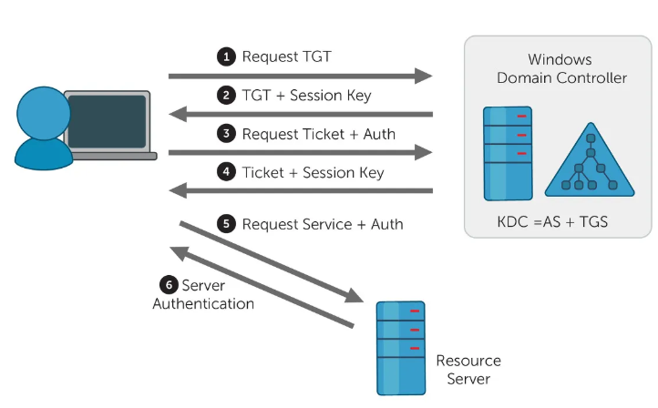
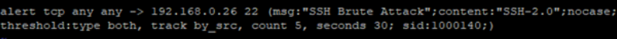

#### 1. 다음 중 ebXML의 구성요소로 옳은 것은?

> ① 전송/라우팅/패키징  
> ② 핵심 컴포넌트  
> ③ 등록기/저장소  
> ④ 위의 모두

**정답:**  
④ 위의 모두

**설명:**  
ebXML의 주요 구성요소는  

- 전송/라우팅/패키징(Transport, Routing, Packaging)  
- 핵심 컴포넌트(Core Component)  
- 등록기/저장소(Registry/Repository)  
등이 있습니다.  
따라서 보기에서 모두 포함되어 있다면 "모두"가 정답입니다.

---

#### 2. 다음 중 버퍼 오버플로우를 유발시키는 행위가 아닌 것은?

> ① 프로그램 개발 시 메모리 공간 제한을 두지 않음  
> ② 사용 가능한 메모리 공간을 초과해서 데이터를 입력  
> ③ 개발 시 할당된 메모리를 회수하지 않음  
> ④ 입력값 검증 없이 데이터를 처리함

**정답:**  
③ 개발 시 할당된 메모리를 회수하지 않음

**설명:**  

- ①, ②, ④는 모두 버퍼 오버플로우의 원인이 될 수 있습니다.  
- ③ "할당된 메모리를 회수하지 않음"은 **메모리 누수(Leak)**의 원인이지만, 버퍼 오버플로우와는 직접적인 관련이 없습니다.  
따라서 ③번이 정답입니다.

#### 버퍼오버플로우 공격을 완화할 수 있는 방법으로 스택과 힙영역에 쉘코드 등을 실행하지 못하도록 하는 메모리 보호기법에 해당하는 것은?

① ASLR ❷ DEP/NX bit ③ Format String ④ Stack Canary

---

#### 3. 커버로스 동작과정 방식 설명으로 옳은 것은?

- 보기 아래 보기 6개 항목 중 맞는 것 선택

>
> 1. 사용자는 인증서비스에 인증
> 2. 인증서비스는 사용자에게 시작 티켓을 전송
> 3. 사용자는 서비스 접근 요청
> 4. TGS는 세션키가 포함된 새로운 티켓을 만든다
> 5. 사용자는 하나의 세션키를 추출하고 티켓을 파일 서버로 전송
> 6. 티켓을 받은 서버는 사용자에게 대한 서비스 제공여부 결정

##### 다음 중 커버로스에 대한 설명으로 올바르지 못한 것은 무엇인가?

> ① MIT에서 개발한 분산 환경 하에 개체인증 서비스를 제공한다.
> ② 클라이언트, 인증서버, 티켓서버, 서버로 구성된다.
> ❸ 커버로스는 공개키 기반으로 만들어 졌다.
> ④ 커버로스의 가장 큰 단점은 재전송공격에 취약하다는 것이다.

> ① 패스워드 바꾸면 비밀키도 바꿈,
> ② 무작위 공격 취약,
> ③ 공개키를 이용하여 암호화를 수행한다,
> ④ 재생공격 가능

##### 커버로스(Kerberos) 인증에 대한 설명으로 옳지 않은 것은?

> ① 커버로스 인증은 MIT에서 개발한 중앙 집중적 인증 시스템이다.
> ② 커버로스 인증은 티켓 서버와 인증서버가 존재하고 티켓을 발급받아 이중시스템으로 인증한다.
> ③ 커버로스는 대칭키 기반 인증시스템을 사용한다.
> ❹ 커버로스의 인증과정 중에서, 인증 서버는 사용자의 비 대칭키로 메시지를 암호화해서 전송한다.

##### 커버로스(Kerberos)에 대한 설명으로 올바르지 못한 것은?

> ① 비밀키 인증프로토콜이다.
> ② SSO 기능을 지원한다.
> ❸ 암호화 인증을 위해 RSA를 사용한다.
> ④ 사용자와 네트워크 서비스에 대한 인증이 가능하다.

---

#### 4. 에러 레벨 중 매핑이 맞는 것은?

|Error Level|내용|
|:--|:--:|
|1) Emerg|에러를 의미함|
|2) Alert|불안정한 시스템 상황|
|3) Crit|중대한 에러 발생|
|4) Error|비교적 중대하지 않은 에러|
|5) Warn|경고 발생|
|6) Notice|일반적인 메시지 발생|
|7) Info|정보 제공|
|8) Debug|디버깅 정보|

---

#### 5. 가상사설망(VPN)의 터널링에 사용되는 프로토콜이 아닌 것은?

> ① PPTP ② L2F ❸ RSVP ④ IPSec

**정답:**
❸ RSVP

**설명:**
PPTP, L2F, IPSec은 모두 VPN 터널링에 사용되는 프로토콜입니다.
RSVP(Resource Reservation Protocol)는 네트워크에서 대역폭 등 자원 예약을 위한 프로토콜로, VPN 터널링에는 사용되지 않습니다.
따라서 VPN 터널링에 사용되지 않는 프로토콜은 RSVP입니다.

---

#### 6. snort 명령어 설명중 틀린것은?


 " alert tcp any any -> 192.168.0.24 22 (msg: "SSH Brute Attack";content:"SSH-2.0"

> ①  alert : 경고를 발생시키고 탐지 정보를 로그파일에 기록한다.
> ②  "->" (디렉션) : 화살표 방향대로 패킷이 흐른다. -> 역방향으로 하면 해당방향으로 패킷을 보낸다(?)
> ③  tcp : tcp 프로토콜 탐지
> ④  content : 룰의 이름을 지정한다.

**정답:**  
④ content : 룰의 이름을 지정한다.

**설명:**  
- `content`는 **패킷 내 특정 문자열(내용)을 탐지**하는 옵션입니다.  
- 룰의 이름을 지정하는 옵션은 `msg`입니다.  
따라서 ④번이 틀린 설명입니다.

---

#### 7. 다음 중 스푸핑(Spoofing) 공격의 종류가 아닌 것은?

> ① ARP 스푸핑  
> ② DNS 스푸핑  
> ③ IP 스푸핑  
> ④ UDP 스푸핑

**정답:**  
④ UDP 스푸핑

**설명:**  
- ARP, DNS, IP 스푸핑은 모두 대표적인 스푸핑 공격입니다.  
- UDP 스푸핑은 일반적으로 사용되지 않는 용어로, 스푸핑 공격의 종류에 포함되지 않습니다.  
따라서 ④번이 정답입니다.

---

#### 8. CentOS 7 이상에서 패스워드 정책(암호 복잡성, 길이 등) 설정 파일로 올바른 것은?

> ① /etc/pam.d/system-auth  
> ② /etc/security/pwquality.conf  
> ③ /etc/login.defs  
> ④ /etc/passwd

**정답:**  
② /etc/security/pwquality.conf

**설명:**  
CentOS 7 이상에서는 패스워드 복잡성 정책을 `/etc/security/pwquality.conf` 파일에서 설정합니다.  
이 파일에서 암호 최소 길이, 대문자/소문자/숫자/특수문자 포함 여부 등을 지정할 수 있습니다.

---

#### 9. 다음은 CentOS의 패스워드 정책을 위한 PAM 설정 코드이다. 보기 중 틀린 것을 고르시오.

- minlen=8 retry=3 ocredit=1 ucredit=1 dcredit=1 maxrepeat=5

> ① 패스워드 최소 길이는 8자 이상이어야 한다.  
> ② 틀렸을 때 시도할 수 있는 횟수는 3번이다.  
> ③ 숫자, 영문 소문자, 특수문자가 1개 이상 들어가야 한다.  
> ④ 이전에 입력했던 문자열은 5번 시도할 수 없다.

**정답:**  
③ 숫자, 영문 소문자, 특수문자가 1개 이상 들어가야 한다.

**설명:**  
- `ucredit=1` : 대문자 1개 이상  
- `lcredit=1` : 소문자 1개 이상  
- `dcredit=1` : 숫자 1개 이상  
- `ocredit=1` : 특수문자 1개 이상  
따라서 보기에서 **소문자(lcredit)가 빠져 있으므로** ③번이 틀린 설명입니다.

---

#### 10. 다음 중 SATAN을 기반으로 개발된 취약점 분석 도구는 무엇인가?

> ① Nessus  
> ② Nmap  
> ③ COPS  
> ④ SARA

**정답:**  
④ SARA

**설명:**  
- **SARA**(Security Auditor's Research Assistant)는 SATAN을 기반으로 개발된 네트워크 취약점 분석 도구입니다.  
- Nessus, Nmap, COPS는 각각 다른 계열의 보안 도구입니다.  
따라서 SATAN 기반 도구는 **SARA**가 정답입니다.

---

#### 11. WAP 환경에서 서버와 클라이언트 간의 인증, 전자서명, 암호화 등 인증서 기반의 보안을 제공하는 공개키 기반 구조는 무엇인가?

> ① WPKI
> ② WML
> ③ WTLS  
> ④ WIPI

**정답:**  
① WPKI

**설명:**  
WPKI(Wireless Public Key Infrastructure)는 무선(WAP) 환경에서 인증서 기반의 보안(전자서명, 암호화 등)을 제공하는 공개키 기반 구조입니다.

---

#### 12. 3계층 터널링 프로토콜은?

> ① PPTP VPN ② L2TP VPN ❸ IPSec VPN ④ SSL VPN

**정답:**  
❸ IPSec VPN

**설명:**  
IPSec VPN은 OSI 7계층 중 **3계층(네트워크 계층)**에서 동작하는 터널링 프로토콜입니다.
PPTP와 L2TP는 데이터링크 계층(2계층)에서 주로 동작합니다.
SSL VPN은 전송 계층(4계층)에서 동작합니다.
따라서 3계층 터널링 프로토콜은 IPSec VPN이 정답입니다.

---

#### 13. 보기 에서 설명 하는 무선 네트워크 표준은?

- 차량과 차량간의 통신이 가능하다  
- 차량과 외부 기기 간의 통신이 가능하다  
- 200km/h 속력으로 달려도 통신에 지장이 없다

> ① 802.11p  
> ② 802.11k  
> ③ 802.11r  
> ④ 802.11ac  

**정답:**  
① 802.11p  

**설명:**  
- **802.11p**는 차량 간(V2V, Vehicle-to-Vehicle) 및 차량-인프라(V2I, Vehicle-to-Infrastructure) 통신을 지원하는 무선 네트워크 표준입니다.  
- 고속 이동(200km/h 이상) 환경에서도 안정적인 통신이 가능하도록 설계되었습니다.  
- 802.11k는 무선 네트워크 관리, 802.11r은 빠른 로밍, 802.11ac는 고속 무선랜(Wi-Fi) 표준입니다.  
따라서 차량 간/차량-외부 통신 및 고속 이동 지원은 **802.11p**가 정답입니다.

---

#### 14.  다음 중 Xpath, XQuery 관련 공격에 해당하는 것은?

> ① SQL Injection
> ② XML Injection
> ③ Command Injection
> ④ XSS

**정답:**  
② XML Injection

**설명:**  

Xpath Injection과 XQuery Injection은 XML 데이터를 처리하는 쿼리문에 악의적인 입력값을 삽입하여, 인증 우회, 데이터 노출 등 공격을 수행하는 기법입니다.
이는 XML Injection의 한 종류로 분류됩니다.
SQL Injection은 SQL 쿼리문, XSS는 스크립트 삽입, Command Injection은 시스템 명령어 삽입 공격입니다.
따라서, Xpath/XQuery 관련 공격은 XML Injection이 정답입니다.

---

#### 15.  아래의 설명에 맞는 공격 대응 방법은?

- 한국인터넷진흥원에서 제공하는 서비스로 악성봇에 감염된 PC를 해커가 제어하지 못하도록 하는 방법

> ① DNS Routing
> ② DNS Spoofing
> ③ DNS Wormhole
> ④ DNS Sinkhole

---

#### 16. 다음 중 DNS 프로토콜/패킷 분석 시 필요 없는 명령어(도구)는 무엇인가?

> ① dig
> ② nslookup
> ③ host
> ④ ifconfig

**정답:**  
④ ifconfig

**설명:**  
dig, nslookup, host는 모두 DNS 질의 및 응답(프로토콜/패킷) 분석에 사용하는 명령어입니다.
ifconfig는 네트워크 인터페이스 설정 및 확인 명령어로, DNS 패킷 분석과는 직접적인 관련이 없습니다.
따라서, 필요 없는 것은 ifconfig입니다.

---

#### 17. 아래의 내용에 맞는 기술은?

- **이미지, 오디오, 비디오 등 다양한 데이터 파일에 정보를 은밀하게 숨기는 기술**을 의미합니다.
- 예를 들어, 그림 파일의 픽셀 값 일부를 조작해 메시지를 숨기거나, 오디오 파일의 소리 일부에 정보를 삽입할 수 있습니다.
- 주로 **비밀 메시지 전달, 저작권 보호, 워터마킹** 등에 활용됩니다.

> ① 디지털 워터마크
> ② 핑거프린트
> ③ DOI
> ④ 스테가노그래픽

**정답:**  
④ **스테가노그래픽(Steganography)**

**설명:**  
스테가노그래픽은 데이터 파일 내부에 정보를 은닉하여,  
외부에서 쉽게 알아차릴 수 없도록 숨기는 정보 은닉 기술입니다.
**스테가노그래픽(Steganography)**이란  
- 암호화가 데이터 자체를 변형하여 숨기는 것이라면,  
  **스테가노그래피는 데이터 안에 비밀 정보를 삽입**하여 존재 자체를 감추는 것이 특징입니다.r

---

#### 18. 다음 중 자바 기반 로깅 라이브러리 Log4j의 취약점(JNDI Lookup 기능 악용)에 대한 설명으로 옳지 않은 것은?

> ① 공격자가 JNDI Lookup 기능을 이용해 원격에서 악성코드를 실행할 수 있다.
> ② 취약점 대응 방법으로 Log4j를 2.15.0 이상으로 업데이트한다.
> ③ log4j2.formatMsgNoLookups 옵션을 true로 설정하면 취약점이 완화된다.
> ④ JNDI 기능을 활성화하면 취약점이 해결된다.

**정답:**  
④ JNDI 기능을 활성화하면 취약점이 해결된다.

**설명:**  
JNDI 기능을 비활성화해야 취약점이 해결됩니다.
Log4j 2.15.0 이상으로 업데이트, log4j2.formatMsgNoLookups=true 설정, JNDI 기능 비활성화가 모두 대응 방법입니다.
JNDI 기능을 활성화하면 오히려 취약점에 노출됩니다.

---

### 19. 다음은 라우터에서 SNMP 커뮤니티 스트링을 설정하는 명령어 예시이다. 올바른 설정 방법으로 맞는 것은?

```shell
Router > enable 
Router# configure terminal 
Router(config)# 
Router(config)# snmp–server community “community string” ro/rw
```

**정답:**  
> ① snmp-server community public ro
> ② snmp-server community private rw
> ③ snmp-server community admin ro
> ④ snmp-server community public rw

(보기 중 실제로 맞는 것은, 커뮤니티 스트링과 권한(ro: 읽기, rw: 읽기/쓰기)이 올바르게 설정된 명령어입니다.)

**설명:**  
snmp-server community <커뮤니티스트링> <권한> 형식으로 설정합니다.
ro는 읽기 전용, rw는 읽기/쓰기 권한입니다.
보안상 기본값(public, private) 대신 복잡한 커뮤니티 스트링을 사용하는 것이 좋습니다.
- snmp set <커뮤니티스트링>
- snmp-server <커뮤니티스트링>

---

### 20. nmap 스캔 방식 중에서 응답이 다른 하나는 무엇인가?

> ① TCP Connect 스캔
> ② SYN 스캔
> ③ FIN 스캔
> ④ UDP 스캔

**정답:**
④ UDP 스캔

**설명:**
TCP 기반 스캔(Connect, SYN, FIN)은 주로 TCP 프로토콜을 사용하며, 포트가 열려 있으면 특정 응답(TCP 플래그 등)을 받습니다.
UDP 스캔은 연결 기반이 아니기 때문에, 포트가 열려 있으면 일반적으로 아무 응답도 오지 않는 경우가 많아 응답 방식이 다릅니다.

---

### 20. 다음 중 NetBIOS에 포함되지 않는 것은 무엇인가?

> ① 이름 서비스(Name Service)
> ② 세션 서비스(Session Service)
> ③ 데이터그램 서비스(Datagram Service)
> ④ 파일 전송 서비스(File Transfer Service)

**정답:**
④ 파일 전송 서비스(File Transfer Service)

**설명:**
NetBIOS는
이름 서비스(Name Service, 포트 137)
데이터그램 서비스(Datagram Service, 포트 138)
세션 서비스(Session Service, 포트 139)
를 제공합니다.
파일 전송 서비스는 NetBIOS의 기본 서비스가 아니므로 정답입니다.

---

### 21. 다음 중 VTP(VLAN Trunking Protocol)에 대한 설명으로 옳지 않은 것은?

> ① VTP는 VLAN 정보를 스위치 간에 자동으로 전파하는 프로토콜이다.
> ② VTP는 Cisco 스위치에서 지원된다.
> ③ VTP를 사용하면 모든 스위치에서 VLAN을 개별적으로 설정해야 한다.
> ④ VTP는 트렁크 링크를 통해 VLAN 정보를 전달한다.

**정답:**
③ VTP를 사용하면 모든 스위치에서 VLAN을 개별적으로 설정해야 한다.

**설명:**
VTP는 Cisco 스위치에서 VLAN 정보를 트렁크 링크를 통해 자동으로 전파하는 프로토콜입니다.
VTP를 사용하면 한 번의 설정으로 여러 스위치에 VLAN 정보를 동기화할 수 있으므로, 모든 스위치에서 개별적으로 VLAN을 설정할 필요가 없습니다.
따라서 ③번이 틀린 설명입니다.

---

### 22. 다음 중 애플리케이션에서 가능한 공격이 아닌 것은?

> ① Memcached
> ② 멜트다운(Meltdown)
> ③ 하트블리드(Heartbleed)
> ④ 세션 하이재킹(Session Hijacking)

**정답:**
② 멜트다운(Meltdown)

**설명:**
Memcached: 캐시 서버를 악용한 DDoS 등 애플리케이션 공격에 사용될 수 있음
하트블리드(Heartbleed): OpenSSL 라이브러리의 취약점을 이용한 애플리케이션 공격
세션 하이재킹: 웹 애플리케이션에서 세션 탈취 공격
멜트다운(Meltdown): CPU 하드웨어 취약점으로, 애플리케이션 레벨이 아닌 하드웨어(프로세서)에서 발생하는 공격
따라서 애플리케이션에서 가능한 공격이 아닌 것은 멜트다운입니다.

---

### 23. 다음 중 DNS 레코드 중 메일 서버 기능을 하는 레코드는 무엇인가?

> ① A
> ② NS
> ③ MX
> ④ SOA

**정답:**
③ MX

**설명:**
MX(Mail Exchange) 레코드는 메일 서버를 지정하는 DNS 레코드입니다.
A는 주소 레코드, NS는 네임서버, SOA는 권한 시작(Zone의 정보) 레코드입니다.
메일 서버 기능을 하는 레코드는 MX입니다.

---

### 24.다음 중 저널링(Journaling)이 지원되는 파일시스템은 무엇인가?

> ① FAT32
> ② NTFS
> ③ EXT3
> ④ EXT2

**정답:**
② NTFS
③ EXT3

**설명:**
NTFS(Windows), EXT3(Linux)은 저널링 기능을 지원하는 파일시스템입니다.
FAT32, EXT2는 저널링을 지원하지 않습니다.
저널링은 시스템 장애 시 데이터 복구를 돕는 기능입니다.
저널링 기술은 EXT2 파일시스템에서 사용하는 fcsk(file system check)의 사간이 오래 걸리는 단점을 보완한 파일시스템 복구 기술이다.