# 정보보안기시 실기

## 1. 시스템 보안

### ◎ WEB 구조

- 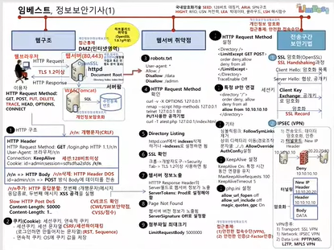

#### 1) WEB 구조

- 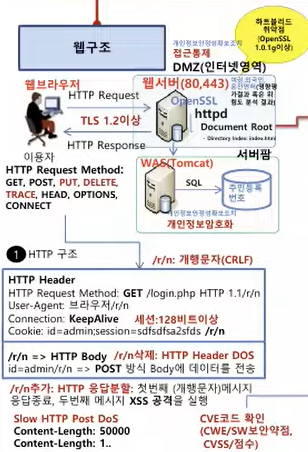

#### 2) 쿠키(Cookie) : 세션쿠키, 영속적 쿠키

- 세션쿠기(Session Cookie): 세션 문자열 **CSRF/세션하이재킹** (로그인하면 만들어지는 문자열)**(RST, Sequence)**
- 영속적쿠키(Persistent Cookie) : 디스크에 쿠키 값을 저장 (Expires 또는 Max-Age 속성이 있는, 지정된 시간 동안 유지하는 쿠키를 의미)

##### 쿠키 구조와 속성

- 이름(Name): 쿠키를 구분하는 고유 키.
- 값(Value): 저장할 데이터.
- 도메인(Domain): 쿠키가 유효한 도메인을 지정한다.
- 경로(Path): 특정 URL 경로에서만 유효하도록 설정한다.
- 유효기간(Expires/Max-Age): 쿠키의 만료 시점을 설정한다.
- 보안 속성(Secure, HttpOnly): HTTPS로만 전송되거나, JavaScript에서 접근하지 못하도록 설정한다.

```javascript
set-cookie: sessionid=abcde1234; expires=Sat, 26-Dec-2020 00:00:00 GMT; path=/; domain=.google.com; Secure; HttpOnly # 영속적 쿠키
Set-Cookie: sessionId=abc123; Path=/; Domain=example.com; Secure; HttpOnly
Set-Cookie: user=JohnDoe; Path=/; Max-Age=3600; HttpOnly
```

|값|Java|설명|
|:-|:--|:---|
|Secure|`setSecure(true)`|`Secure 통신(SSL/TLS)을 수행하는 경우에만 클라이언트에서 해당 쿠키를 전송함으로써 기밀성을 보장함. 스니핑 공격을 통한 쿠키 정보 탈취에 대응 가능.`|
|HttpOnly|`setHttpOnly(true)`|`웹브라우저에서 자바스크립트(document.cookie) 등을 통한 해당 쿠키 접근을 차단함. 쿠키 탈취를 위한 XSS(Cross Site Scripting) 공격에 대응 가능`|
|Expires|`setMaxAge(60*60*24); //60초 * 60분 * 24시간`|`쿠키가 만료되는 날짜 및 시간을 설정함. 쿠키가 탈취당하여 재사용되는 리스크를 최소화할 수 있음`|

### ◎ WEB 서버 취약점

#### 1) robots.txt

|구분|설명|
|:---|:---|
|파일명|`반드시 robots.txt으로 설정`|
|파일 위치|`반드시 루트 디렉터리(/)에 위치 (아니면 효력 없음)`|
|파일 내용|`대/소문자를 구분함`|
|띄어쓰기 주의|`User-agent, Allow, Disallow 등의 필드와 콜론(:)은 붙어야함. 콜론(:) 이후 공백이 하나 추가되고 내용이 이어짐`|

```shell
User-agent: *
Allow: /
Disallow: /data
Disallow: /admin
```

#### 2) HTTP Request Method 확인

```shell
curl -v -X OPTIONS 127.0.0.1
nmap --script http-methods 127.0.0.1
telnet 127.0.0.1 80
# PUT 사용한 공격 기법
curl -T attack.php -X PUT http://www.example.com/upload/
```

#### 3) Directory Listing

- /etc/https/conf/https.conf에서 indexes 삭제하거나 -indexes로 설정하면 됨

#### 4) SSL 확인

- 크롬 → 개발자 도구 → Security Tab → TLS 1.2이상 사용하면 됨
- 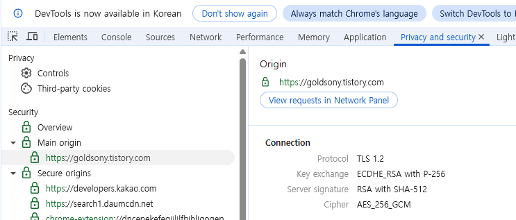

#### 5) WEB 서버 정보 노출

- HTTP Response HeadSet의 Server 필드로 웹서버 정보가 노출

```shell
HTTP/1.1 200 OK
Date: Mon, 21 Jul 2025 00:00:00 GMT
Server: Apache/2.4.41 (Win64) OpenSSL/1.1.1g
Content-Type: text/html; charset=UTF-8
Content-Length: 1234
```

- httpd의 설정 파일인 httpd.conf에 값 추가하여 노출 방지

```shell
ServerTokens Prod
ServerSignature Off
```

#### 6) [Page Not Found](https://aegypius.tistory.com/entry/아파치-웹-서버의-정보-숨기기)

- 웹서버 버전 정보가 노출됨

```shell
ServerSignature Off # Defult가 off임
```

#### 7) 첨부파일 최대크기

- LimitedRequestBody

#### 8) HTTP Request Method 설정

- Limit : GET, POST, HEAD 메서드만 허용하고 다른 메서드는 차단
- LimitExcept : GET, POST, HEAD 메서드를 제외하고 모든 메서드를 차단

```shell
<Limit GET POST HEAD>
    Order allow,deny
    Allow from all
</Limit>

<LimitExcept GET POST HEAD>
    Order deny,allow
    Deny from all
</LimitExcept>
```

#### 9) 특정 IP만 연결

- 아파치 2.4 버전부터는 Order, Allow, Deny 대신 Require directives를 사용합니다.

```shell
<Directory "/var/www/html">
    Require all denied
    Require ip 192.168.1.100
</Directory>
```

#### 10) 기타

- 심볼릭링크 : FollowSymLinks제거
- 상위 디렉터리 이동(경로조작 문자열 ../../)  제거

```shell
     <Directory />
         AllowOverride None
         Require all denied
     </Directory>
```

- KeepAlive On : 특정시간 동안 연결을 유지

```shell
KeepAlive On
MaxKeepAliveRequests : 50
MaxAliveTimeout : 1
```

#### 11) php.ini  설정

- allow_url_fopen = Off : 파일 액세스시 외부사이트 파일을 불러올 수 있는지여부 설정(보안상 Off로 설정할 것을 권장함)
- allow_url_include = Off : php프로그램내에 파일 뿐만 아니라 URL(FTP, HTTP)등을 이용하여 파일을 include 시킬 수 있다.
- magic_quotes_gpc = On : PHP에서 GET, POST, COOKIE를 통해 전달되는 데이터에 자동으로 슬래시(\\)를 추가하여 SQL injection 공격을 방지하던 기능,  PHP 5.4부터 사용하지 않음

### ◎ 전송구간 보안기법

#### 1) SSL

- [하트블리드 취약점(OpenSSL 1.0.1 이상)](https://sudo-minz.tistory.com/8)
- 

#### 2) IPSEC

- 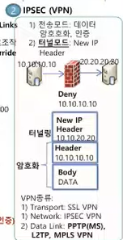

**설명:**

- 종단 노드 구간 또는 보안/터널 게이트웨이 구간에 IP 패킷 보안 서비스를 제공해주는 네트워크 계층 보안 프로토콜
- 키교환을 위해 IKE(Internet Key Exchange) 프로토콜을 사용
- IPsec 동작 모드는 Transport Mode, Turnel Mode가 있음
  - Transport Mode : IP Packet에서 `Payload`만 보호
  - Turnel mode : `IP Packet 전체`를 보호
- IPsec 세부 프로토콜에는 AH, ESP가 있음
  - AH(Authentication Header) 프로토콜 : 메시지 인증 코드(MAC)를 이용하여 **인증(무결성)**만 지원
  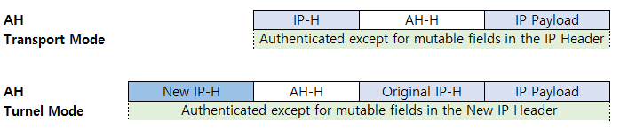
  - ESP(Encapsulating Security Payload)  프로토콜 : 인증, `암호화` 둘다 지원
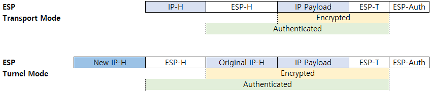

---

- 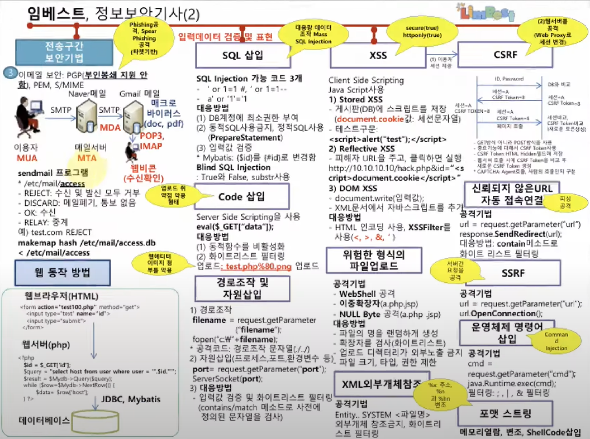

#### 3) 이메일 보안

- 이메일 보안 : PGP(**부인방지 지원 안함**), PEM, S/MIME
- 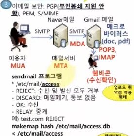

##### [SPF (Sender Policy Framework) 메일 보안](https://spam.kisa.or.kr/spam/cm/cntnts/cntntsView.do?mi=1033&cntntsId=1034)

- 메일서버 정보를 사전에 DNS에 공개 등록함으로써 수신자로 하여금 이메일에 표시된 발송자 정보가 실제 메일서버의 정보와 일치하는지를 확인할 수 있도록 하는 인증기술

##### [sendmail access 설정](https://meongj-devlog.tistory.com/109)

- /etc/mail/access

```shell
# vi /etc/mail/access
From:spam.com     REJECT   // 발신지 도메인이 spam.com으로부터 오는 메일을 거부한다.
```

- 메일 서버로 접근하는 메일 접근 제어하는 파일이다.
- 메일 서버 접근 호스트나 도메인을 제어한다.

> Connect : 접속하는 클라이언트 주소, 이름
From : 메일 보낸 주소
To : 메일 보낼 주소

> RELAY : 접근 허용(중계)
REJECT : 메일 거부, 거부 메시지 출력(수신 및 발신 모두 거부)
DISCARD : 메일 거부, 메시지 없음(메일폐기, 통보없음)
OK : DNS 미 조회시에도 메일 허가(수신)

```shell
# makemap hash /etc/mai/access < /etc/mail/access
```

#### 4) 웹 동작 방법

- 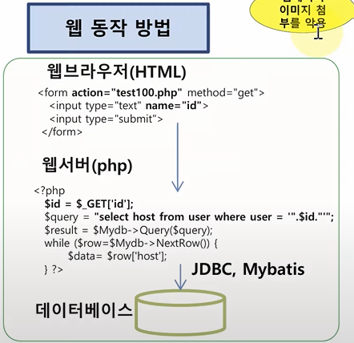

### ◎ 취약점 곰경

#### 1) SQL 삽입

- SQL Injection 가능 코드

```shell
' or 1=1 #,  ' or 1=1 --, a' or '1'='1
```

- 대응방법
  - db계정에 최소권한 부여
  - 동적SQL 사용(PreparedStatement)
  - 입력값 검증
    - Mybatis : {$id}를 {#id}로 변경함
    - [Blind SQL Injection](https://maker5587.tistory.com/55) : True 와 False, substr 사용

#### 2) Code 삽입(업로드 취약점 악용 형태)

- Server Side Scripting을 사용

```shell
eval($_GET["data"]);
```

- 대응방법
  - 동적함수를 비활성화
  - 화이트리스트 필터링
    - 업로드: test.php%80.png (웹에디터 이미지 첨부를 악용)

#### 3) 경로조작 및 자원 삽입

##### (1) 경로조작

```java
filename = request.getParameter("filename");
foptn("c:\"+ filename);
# 공격코드 : 경로조작 문자열()../../)
```

##### (2) 자원삽입(프로세스,포트,환경 변수 등)

```java
port = request.getParameter("port");
ServerSocket(port);
```

##### (3) 대응방법

- 입력값 검증 및 화이트리스트 필터링(contains/match 메소드로 사전에 정의된 문자열을 검사)

#### 4) [XSS(scure(true), httponly(ture))](https://studysteadily.tistory.com/9)

- Client Side Scripting, javascript사용

##### (1) Stored XSS

- 게시판(DB)에 스크립트를 저장(docement.cookie값: 세션문자열)
- 테스트구문 `<script>alert("test");</script>`

##### (2) Reflective XSS

- 피해자 URL을 주고, 클릭하면 실행
`http://10.10.10.10/hack.php&id="<script>document.cookie</script>`

##### (3) DOM XSS

- document.write(입력값)
- XML문서에서 자바스크립트를 추가

- 대응방법
  - HTML 인코딩 사용, **XSSFilter**를 사용(<, >, &, ')

#### 5) 위험한 형식의 파일 업로드

- 공격기법
  - **WebShell** 공격
  - **이중확장자**( a.php.jsp)
  - **NULL Byte** 공격(a.php .jsp)

#### 6) XML외부개체참조

- 공격기법
  - Entity..SYSTEM <파일명>
  - 외부개체 참조금지, 화이트리스트 필터링
  
#### 7) CSRF(Cross-site request forgery):(웹서버를 공격-WEB Proxy로 세션 변경)

- 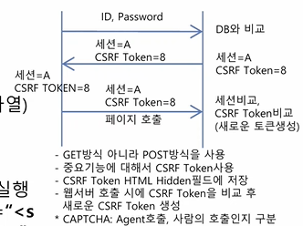
- <https://velog.io/@gwanuuoo/CSRF-공격과-방어-기법>

#### 8) 신뢰되지 않은 URL자동 접속 연결(피싱공격)

- 공격기법(`사용자에게 URI 입력 받아 악의적인 행위를 하는 URI 로 이동하여 서버 내부 접근, 정보유출 등 공격`)

```java
url = request.getParameter("url");
response.SendRedirect(url);
```

- 대응방법
  - contain 메소드로 화이트 리스트 필터링

#### 9) SSRF(서버간 요청을 공격)

- 공격기법

```java
url = request.getParameter("url");
urlOpenConnection();
```

#### 10) 운영체졔 명령어 삽입(Command Injection)

- 공격기법

```java
cmd = request.getParameter("cmd");
java.Runtime.exec(cmd);
# 핕러링:;.|,& 필터링
```

#### 11) 포맷스트링(%x: 주소, %n과 %hn 변조)

- 메모리 열람, 변조, ShellCode삽입

---

- 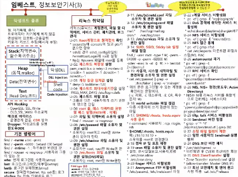

### ◎ 악성코드 종류

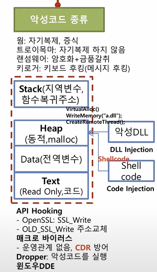

- 매크로 바이러스 CDR(Contents Disarm&Reconstruction)

#### Dropper 유형

##### 1) URL 다운로드 & 실행 유형

##### 2) Resource 유형

##### 3) Injection 유형

- DLL Injection
- Process Hollowing
- PE Injection
- Thread Injection / Thread Hijacking

#### 리눅스 기본명령어

```shell
find / -name a.txt -print
find / -perm 6000 # Setuid or Setgid
chmod -s <file_name> # SUID와 SGID를 제거
find / -mtime -1 # 하루동안 변경된 것
find / nouser -o nogroup # 사용자와 그룹이 없는것
```

##### 리눅스 기본 로그

|로그|설명|
|:-|:-|
|utmp(who)|`현재 로그인된 사용자`|
|wtmp(last)|`로그인/로그아웃/재부팅`|
|btmp(lastb)|`로그인 실패 정보`|
|lastlog(lastlog)|`가장최근에 성공한 로그인 기록`|
|sulog|`su권한변경 로그를 기록한다`|
|acct/pacct(lastcomm)|`시스템에 로그인 한 모든 사용자가 실행한 명령어 정보를 기록`|
|secure|`원격접속(telnet, ftp, ssh등) 로그`|
|xferlog|`ftp 접속, 다운로드 링크`|

### ◎ 리눅스 취약점(주요정보통신 기반시설 상세취약점 가이드)

- 리눅스(유닉스) : 계정관리, 파일 및 디렉터리, 서비스 관리, 패치 관리, 로그 관리
- U-01 : **Root 계정으로 원격접속** 확인
  - securetty에 console이 있고 pts가 없으면 양호
  - ssh의 경우 sshd_config파일의 PermitRootLogin에 no로 설정
  - ftp는 ftpusers 파일에 root를 등록
  
- U-02 : **패스워드 복잡성** 설정
  - `pam_cracklib.s o retr=3 minlen=8 lcredit=-1 ucredit=-1 dcredit=-1 ocredit=-1`

- U-03 : **계정 잠금 임계값** 설정
  - `deny=5 locktime=120`

- U-04 : **패스워드 최대사용기간**을 설정
  - `PASS_MAX_DAYS` /etc/login.defs

- U-05 : **패스워드 파일보호**
  - 그룹과 다른 사용자에게 쓰기 권한이 있으면 안됨

- U-06 : **root 홈, 패스 디렉터리 권한 및 패스 설정(PATH에 . 삭제)**

- U-07 : **파일 및 디렉터리 소유자 설정**
  - `find / -nouser -o nogroup`

- U-08 : **/etc/passwd 파일 소유자 및 권한 설정**
  - 소유자는 root이고  root만 write 권한

- U-09 : **/etc/shadow 파일 소유자 및 권한 설정**
  - 소유자는 root이고  root만 write 권한

- U-10 : **/etc/hosts 파일 소유자 및 권한 설정(DNS파일)**
  - 소유자는 root이고  root만 write 권한

- U-11 : **/etc/(x)inetd.conf 파일 소유자 및 권한 설정**

- U-12 : **/etc/(r)syslog.conf 파일 소유자 및 권한 설정**
  - mail.* /var/log/maillog
  - cron.* /var/log/cron

- U-13 : **/etc/services 파일 소유자 및 권한 설정**

- U-14 : **SUID, SGID, Sticky bit 설정** 파일 점검
  - `find / -user root -type f \(-perm -04000 -o -perm -02000 \) -xdev -exec ls -al {} \; >> test.txt 2>/dev/null`

- U-15 : **사용자, 시스템 시작파일 및 환경파일 소유자 및 권한 설정**
  - `cat /etc/passwd | grep -v '/bin/false' | grep -v 'nologin'` → 로그인할수 있는 계정확인

- U-16 : **world writable 파일 점검**
  - 다른 사용자에 쓰기 권한이 있는 파일

- U-17 : **$HOME/.rhosts, hosts.euqiv 사용금지**
  - r-command 사용방지 : rcp, rlogin, rsh
  - $HOME/.rhosts, hosts.equiv 예) 210,10.10.10 + 소유자를 root로 변경한다

- U-18 : **접속 IP 및 포트 제한**

- U-19 : **cron 파일 소유자 및 권한 설정**
  - 설정 ; 분시일월요일,사용자, 명령
  - `/etc/cron.allow`, `/etc/cron.deny`

- U-20 : **finger 서비스 비활성화**

- U-21 : **Anonymous FTP 비활성화**
  - `/etc/passwd`, `/etc/inetd.conf` 파일

- U-22 : **r계열 서비스 비활성화**
  - `ps -ef | grep -E "rcp|rlogin|rsh"`

- U-23 : **DoS 공격에 취약한 서비스 비활성화**
  - `echo|discard|daytime|chargen` 제거

- U-24 : **NFS 서비스 비활성화**
  - `ps -ef | grep -E "mountd|nfs`

- U-25 : **NFS 접근 통제**
  - `ps -ef | grep nfsd`
  - `cat /etc/exports`  마운트된 파일시스템(RO,RW)

- U-26 : **automountd 제거**
  - `ps -ef | grep -E "automountd|rpc|statdaemon|emi`
  
- U-27 : **RPC 서비스 확인**
  - `ps -ef | grep -E "rpc.cmsd|rpc.ttdbserverd|sadmind|rusersd|walld"`

- U-28 : **NIS, NIS+ 점검(윈도우: Active Directory)**
  - NIS는 N대 리눅스 서버를 통합적으로 관리하는 서비스이다
  - `ps -ef | grep -E "ypserv|ypbind|ypxfrd|rpc.yppasswd|rpc.ypupdated|rpc.nisd"`

- U-29 : **tftp, talk 서비스 비활성화**

- U-30 : **sendmail 버전 점검**
  - `grep -v '^*#' /etc/mail/sendmail.cf | grep DZ`

- U-32 : **스팸 메일 릴레이 제한**

- U-33 : **일반 사용자의 sendmail 실행 방지**

- U-34 : **DNS 보안 버전 패치**
  - `/usr/sbin/named -v`
  - 버전확인 후 CVE와 최신버전 확인

- U-35 : **DNS Zone Transfer** 설정
  - Master DNS 서버와 Slave DNS 서버 간 Zone 파일을 동기화하기 위한 프로토콜
  - `Zone Transfer: named.conf` 설정
  - {allow-transfer: Master DNS IP}
  - <https://ggonmerr.tistory.com/146>

- U-37 : **최신 보안 패치 및 벤더 권고** 사항 적용
  - `cat /etc/*release`

---

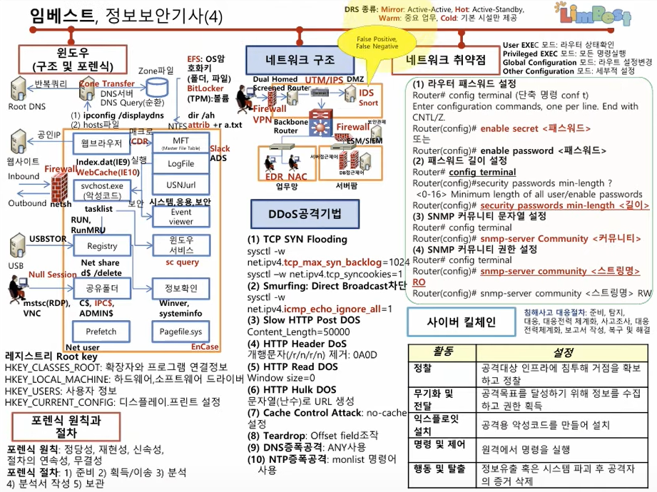

### ◎ 윈도우(구조 및 포렌식)

#### 1) 윈도우 구조

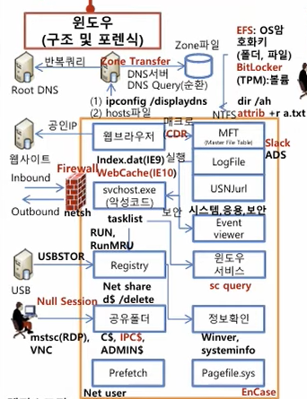

#### 2) 포렌식 원칙과 절차

- 포렌식 **원칙**: 정당성, 재현성, 신속성, 절차의 연속성, 무결성
- 포렌식 **절차**: 준비 → 획득/이송 → 분석 → 분석서 작성 → 보관

#### 3) 네트워크 구조

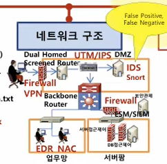

#### 4) 네트워크 취약점

##### [라우터 모드](https://haekt-log.tistory.com/28)

- User EXEC 모드 : Router>  라우터 상태확인, 읽기 전용
- Privileged EXEC 모드 : Router#  권한인 있는 상태에서 진입 가능
- Global Configuration : Router(config)#  라우트 설정변경
- Other Configuration : 세부적 설정

##### 라우터 설정

```shell
# 1) 라우터 패스워드 설정
Router> enable
Router# config terminal #  단축 명령 conf t
Router(config)# enable password [PW]
# 또는
Router(config)# enable secret [PW]

# 2) 라우터 패스워드 길이 설정
Router(config)# security passwords min-length [길이]

# 3) SNMP 커뮤니티 문자열 설정
Router(config)# snmp-server community [커뮤니티]

# 4) SNMP 커뮤니티 권한 설정
Router(config)# snmp-server community [스트링명] RO
# 또는
Router(config)# snmp-server community [스트링명] RW
```

#### 스위치 공격

- Switch Jamming : **MAC address Table 버퍼 오버플로우** 발생
- ICMP Redirect : 라우팅 경로를 위장
- ARP Redirect : 라우터 MAC주소 변경, **ARP Reply 전송**
- ARP Spoofing : **ARP Cache Table을 공격자 MAC 주소로 변경**

#### [방화벽](https://co-no.tistory.com/entry/네트워크-방화벽-2-구성형태)

- Screening Router : IP, TCP, UDP **헤더**내용만 분석, 내부 네트워크 외부 네트워크 패킷트래픽을 Perm/Drop 하는 라우터이다
- Bastion Host : 내부 네트워크와 외부 네트워크 사이에 **게이트웨이** 역할
- Dual-Homed Host : 2개의 NIC(Network Interface Card)를 가진 배스천 호스트로서, 각각 내부 네트워크 및 외부 네트워크와 연결됨
- Screened Host : 스크리닝 라우터와 배스천 호스트가 함께 구성
- Screened Subnet : 1개의 배스천 호스트와 2개의 스크리닝 라우터

#### 5) 사이버 킬체인(Cyber Kill Chain)

> 사이버킬체인이란 군사용어 킬체인에서 비롯되어 생성된 용어로, 사이버 공격을 방어하기 위한 적극적인 방어 전략이며 여러 공격 단계들 중 일부를 무력화 또는 지연시켜 공격의 효율성을 낮추고 피해를 최소화하는데 그 목적이 있다.

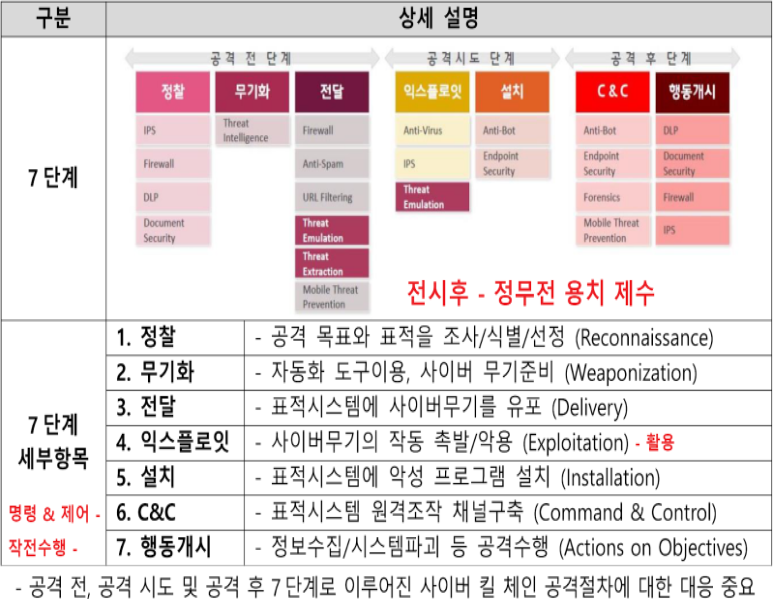

---

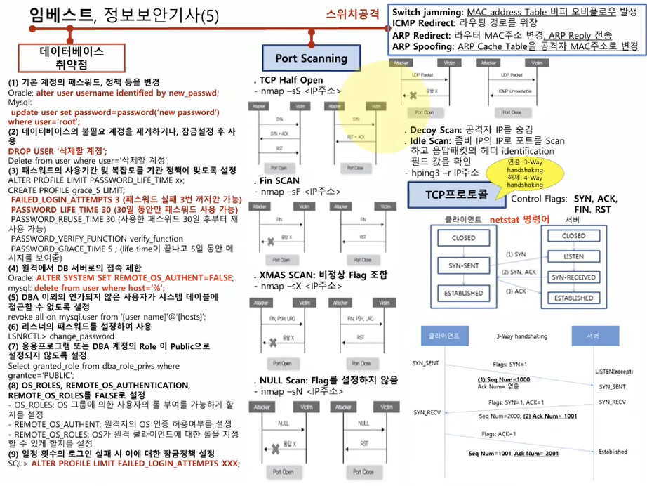

### ◎ 포트 스캔닝(Port Scanning)

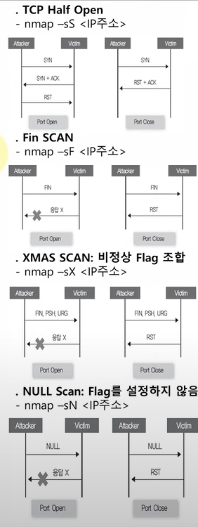

### ◎ TCP프로토콜(연결:3-Way handshaking, 해제: 4-Way handshaking)

- Control Flag : SYN, ACK, FIN, RST

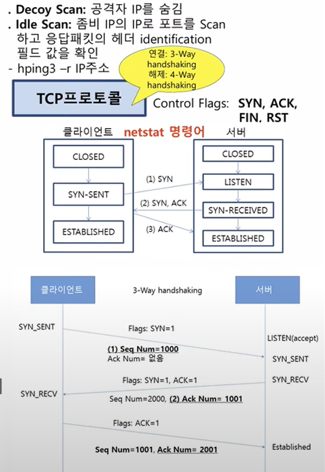

---

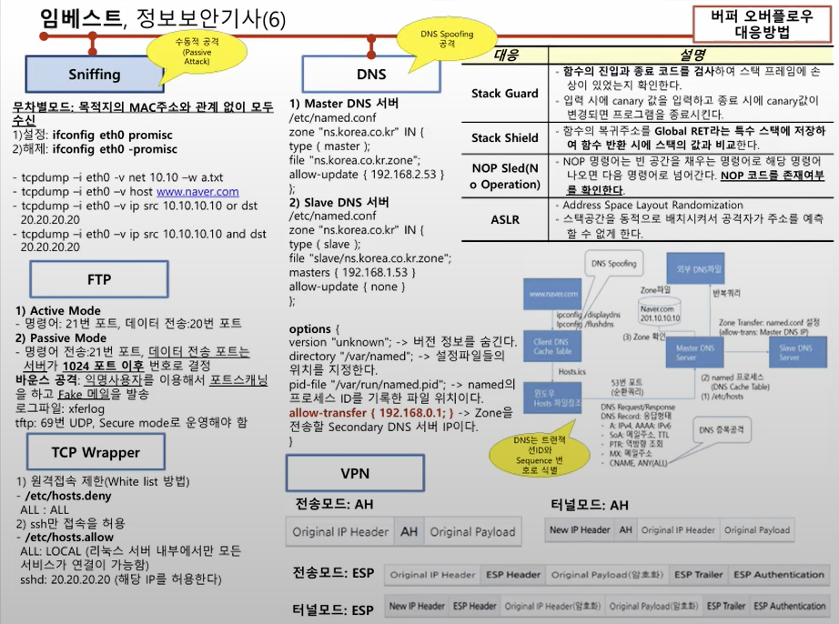

### ◎ Sniffing(수동적 공격: Passive Attack)

- 무차별 모드 : 목적지의 MAC 주소와 관계 없이 모두 수신

```shell
ifconfig eth0 promisc  # 설정
ifconfig eht0 -promisc # 해제
tcpdump -i eht0 -v net 10.10 -w a.txt
tcpdump -i eht0 -v host www.naver.com
tcpdump -i eht0 -v ip src 10.10.10.10 or dst 20.20.20.20
tcpdump -i eht0 -v ip src 10.10.10.10 and dst 20.20.20.20
```

#### TCP Wrapper

> xinetd 기반의 서비스(FTP, Telnet, SSH)에 대해 접근 제어(ACL) 설정이 가능

##### 1) 원격 접속 제한(white list)

- `etc/hosts.deny` ALL:ALL

##### 2) ssh만 접속을 허용

- `etc/hosts.allow`
- ALL:LOCAL (리눅스 서버 내부에서만 모든 서비스가 연결이 가능함)
- sshd: 20.20.20.20(해당 IP를 허용한다)

---

### /etc/passwd

```shell
root : x : 0 : 0 : root : /root : /bin/bash
  ①    ②   ③   ④    ⑤       ⑥        ⑦
```

> ① 사용자 계정
② /etc/shadow 파일에 암호 저장
③ 사용자 ID → root일 경우 0이 됨
④ 사용자 GROUP ID → 사용자가 속한 그룹 ID, root일 경우 0이 됨
⑤ COMMENT
⑥ 홈 디렉토리
⑦ 사용자 기본 shell → **/bin/false 셀**을 실행하지 않게 되어 있음

---

### /etc/shadow

```shell
root : $1$Fz4q1GjE$G/ : 14806 : 0 : 99999 : 7 :  :  :
  ①          ②            ③     ④     ⑤     ⑥   ⑦  ⑧  ⑨
```

> ① 사용자 계정
② password     : (\$6-SHA512, \$5-SHA256, \$4-MD5)($SALT)
③ Last Changed : 1970년 1월 1일 **패스워드가 수정된 날짜의 일수**
④ Minimum : **패스워드 변경 전 최소 사용기간**(일 수)
⑤ Maximum : **패스워드 변경 전 최대 사용기간**(일 수)
⑥ Warn : 패스워드 사용 **만기일 전에 경고 메시지를 제공하는 일 수**
⑦ Inactive : 로그인 접속 **차단일수**
⑧ Expire : **로그인 사용을 금지하는 일 수**
⑨ Reserved

---

### 리눅스 패스워드 최소 길이 변경

```shell
* /etc/login.defs
```

|구분|설명|
|:---|:---|
|PASS_MAX_DAYS|`패스워드 사용가능한 일자`|
|PASS_MIN_DAYS|`패스워드 변경 최소 기간`|
|PASS_MIN_LEN|`패스워드 최소 길이를 설정`|
|PASS_WARN_AGE|`패스워드 기간 만료 경고 기간을 설정`|

---

### PAM 모듈을 사용한 패스워드 설정

- [리눅스PAM 모듈](https://www.igloo.co.kr/security-information/리눅스-pam-모듈의-이해/)

|종류|설명|
|:---|:---|
|.account|`계정 유효성, 서비스 접근허용`|
|.auth|`비밀번호 검증, 생체인식으로 사용자 확인`|
|.password|`인증변경을 제공`|
|.session|`인증 전후에 할 것 제공`|

```shell
vi /etc/pam.d/system-auth
password requisite /lib/security/$ISA/pam_craclib.so
retry=3 minlen=8 lcredit=-1 ucredit=-1 dcredit=-1 ocredit=-1
```

**설명:**

- `ucredit=-1` : 대문자 1개 이상    upper
- `lcredit=-1` : 소문자 1개 이상    lower
- `dcredit=-1` :   숫자 1개 이상    decimal
- `ocredit=-1` : 특수문자 1개 이상  other
  
---

### 실행권한 setuid 찾는법

```shell
find / -perm 4755 -print
```

---

### BOF(Buffer OverFlow) 대응 방법

|대응|설명|
|:---|:---|
|Stack Guard|`함수의 진입과 종료 코드를 검사하여 스택 프레임에 손상이 있었는지 확인한다 \r\n 입력시에 canary 값을 입력하고 종료시에 canary 값이 변경되면 프로그램을 종료 시킨다.`|
|Stack Shield|`함수의 복귀주소를 Global RET라는 특수 스택에 저장하여 함수 반환 시에 스택의 값과 비교한다`|
|NOP Sled(No Operation)|`NOP 명령어는 빈 공간을 채우는 명령어로 해당 명령어 나오면 다음 명령어로 넘어간다. NOP 코드를 존재여부를 확인한다`|
|ASLR|`Address Space Layout Randomization`  \r\n 스택공간을 동적으로 배치시켜서 공격자가 주소를 예측할수 없게 한다|

- ASLR 커널 설정

|커널매개변수|값|설명|
|:---|:-:|:---|
|randomize_va_space|0|`ASLR 해제`|
|randomize_va_space|1|`랜덤 스택 & 라이브러리 활성화`|
|randomize_va_space|2|`랜덤 스택 & 라이브러리 & 힙 활성화`|

```shell
sysctl -w kernel.randomize_va_space=2
```

- DEP(Data Execution Prevention)/NX(Not Excutable) 커널 설정

|커널매개변수|값|설명|
|:---|:-:|:---|
|exec-shield|0|`ExecShield 보호 비활성화`|
|exec-shield|1|`ExecShield 보호 활성화`|

```shell
sysctl -w kernel.exec-shield=1
```

**확인**

```shell
vi /etc/sysctl.conf
kernel.randomize_va_space=0
kernel.exec-shield=0
```

---

### Windows 레지스트리 Root Key

|루트키|설명|
|:---|:---|
|HKEY_CLASSES_ROOT|`파일의 확장자와 설치된 프로그램의 연결된 정보`|
|HKEY_CURRENT_USER|`현재 로그인한 사용자의 환경설정 정보`|
|HKEY_LOCAL_MACHINE|`설치된 HW와 SW 드라이버에 대한 정보`|
|HKEY_USERS|`사용자에 대한 정보`|
|HKEY_CURRENT_CONFIG|`디스플레이와 프린터 설정에 관한 정보`|

---

## 2. 네트워크 보안

### 클래스 범위

|클래스|최상위 비트|서브넷마스크|끝주소|
|:-:|:--|:--:|:--:|
|A|0|`255.0.0.0`|`127.255.255.255`|
|B|10|`255.255.0.0`|`191.255.255.255`|
|C|110|`255.255.255.0`|`223.255.255.255`|
|D|1110|`멀티캐스트로 사용`|`239.255.255.255`|

#### 사설대역 IP(기업 내부 사설환경에서 권장하는 주소 )

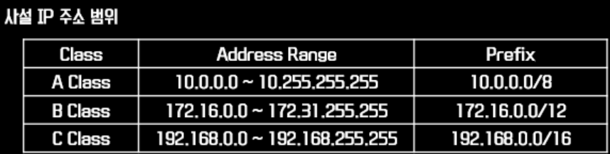

### [nmap](https://m.blog.naver.com/hanajava/222631332784)

- 네트워크 탐색 툴이며 동시에 보안 및 포트스캐너
- 로컬서버나 원격서버의 사용포트 및 운영체제 등의 사용정보를 스캔 하는 명령어

#### nmap 옵션

|옵션|설명|옵션|설명|
|:---|:---|:---|:---|
|S|TCP SYN스캔|U|UDP 스캔|
|T|TCP 연결을 스캔|O|IP프로토콜 스캐닝|
|P|PING 스캐닝|I|Idlesscan|
|A|ACK 스캔|W|Window 스캔|
|R|RPC 스캔|L|List 스캔|

- [기타](https://www.hackingtutorials.org/scanning-tutorials/port-scanning-and-os-detection-with-nmap/) -F –X –N : Stealth FIN, Xmas Tree 또 는 Null 스캔모드

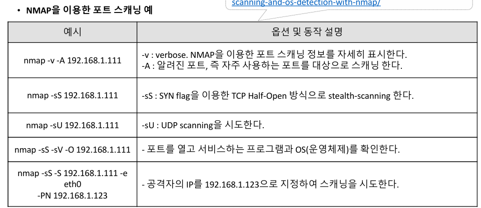

### [NetBIOS(Network Basic Input/Output System)](https://velog.io/@hyena/NetBIOS)

- 네트워크에 대한 기본적인 입출력(Net + BIOS)(Network Basic Input/Output System)
- 네트워크상에서 응용프로그램 간 통신을 지원하는 API입니다.
  - 이름 서비스(Name Service, 포트 137)
  - 데이터그램 서비스(Datagram Service, 포트 138)
  - 세션 서비스(Session Service, 포트 139)

### 무선랜 보안 기술에 대한 설명

> ① 기밀성  → WEP 정적키 사용 문제 → TKIP
> ② 상호인증 EAP(Extensible Authentication Protocol) → WPA2(AES-CCMP 암호화 기능을 향상) → KRACK → WPA3

|무선 LAN보안기술|설명|
|:---|:---|
|WEP|`RC4 알고리즘 사용(IV:초기화백터),`**고정키**`사용`|
|WPA1|`RC4 알고리즘 사용,`**동적키(TKIP)**`사용`|
|WPA2|- WPA2-Personal(PSK,사전공유비밀)|
|WPA2|- WPA2-Enterprise(EAP,인증서버:RADIUS)`EAP(Extensible Authentication Protocol)`|
|WPA2|- AES 대칭키 알고리즘 및 CCMP를 사용|
|WPA3|`GCMP-256 알고리즘 사용`|

### VoIP(인터넷 전화 프로토콜은 음성과 멀티미디어 커뮤니케이션을 인터넷을 통해 가능하게 하는 기술)

---

### ○ IPSec

**설명:**

- 종단 노드 구간 또는 보안/터널 게이트웨이 구간에 IP 패킷 보안 서비스를 제공해주는 네트워크 계층 보안 프로토콜
- 키교환을 위해 IKE(Internet Key Exchange) 프로토콜을 사용
- IPsec 동작 모드는 Transport Mode, Turnel Mode가 있음
  - Transport Mode : IP Packet에서 `Payload`만 보호
  - Turnel mode : `IP Packet 전체`를 보호
- IPsec 세부 프로토콜에는 AH, ESP가 있음
  - AH(Authentication Header) 프로토콜 : 메시지 인증 코드(MAC)를 이용하여 **인증(무결성)**만 지원
  
  - ESP(Encapsulating Security Payload)  프로토콜 : 인증, `암호화` 둘다 지원


---

### LAN 스위칭 기법

|`기법`|`설명`|
|:---|:---|
|Cut through|`스위치로 들어오는`**Frame의 목적지 주소만 확인**`하고 Forwarding한다`|
|Fragment free|**Frame의 512byte만 검사**`하고 Forwoarding한다`|
|Store and forward|**전체 Frame을 수신**`받고 frame을 검사 후 Forwording 한다`|

---

### vLAN

- Static VLAN : 스위치에서 직접 할당하는 방식
- Dynamic VLAN : 대형스위치에서 자동으로 할당, VMPS서버(MAC주소와 VLAN정보가 있음)
- VLAN끼리 통신
  - Access Port : 특정 VLAN에 소속되어 사용되는 포트
  - Trunk Port : 스위치간 트렁크(중계)를 위한 포트(dot1q 가 기본으로 사용됨)
- VTP(VLAN Trunking Protocol): 스위치들이 가진 VLAN 정보를 트렁크 포트를 이용해 교환함으로써 VLAN 정보를 항상 일치시켜주기 위한 프로토콜
- STP(Spanning Tree Protocol):이중화된 스위치의 Looping 을 해결하는 프로토콜

### Switch 공격 및 스니핑 방법

|구분|설명|
|:---|:---|
|Switch Jamming|**스위치의 MAC Address Table에 대해서 버퍼오버플로우** `공격을 수행해서 스위치가` **허브**`처럼 동작하게 만드는 방법`|
|ICMP Redirect|**라우팅 경로를 자신의 주소로 위조한 ICMP Redirect 메시지를 피해자에게 전송한다**|
|ARP Redirect|공격자는 **Router의 MAC주소로 변경하여 ARP Reply 패킷**`을 해당 네트워크에 브로드캐스트한다`|
|ARP Spoofing|`공격자는 위조한 ARP Reply패킷을 피해자에게 전송하여`**피해자의 ARP Cache Table이 공격자의 MAC주소로 변경**`하게 한다`|

---

### DDoS(Distributed Denial-of-Service) 공격비법

> 특정 서버나 네트워크에 순간적으로 대용량 트래픽을 발생시켜 정상적인 서비스를 지연, 마비시키는 공격

#### DDoS의 종류와 방지기술

|공격|특성|방지기술|
|:-|:--|:---|
|SYN Flood|Spoofing된 IP로부터 과도한 SYN 연결요청|`2세대 방화벽(Stateful Inspection-상태 추적): 패킷 단위의 검사가 아닌 세션 단위로 검사를 하는 방화벽`|
|UDP Flood|허용치보다 초과된 수의 UDP패킷을 동시 전송|`IPS, DDoS 전용장비`|
|Zombie 공격|`정상적인 IP에서 합법적인 TCP패킷을 대량 전송`|`DDoS 전용장비`|
|Slammer 공격|`SQL 서버의 1434포트로 UDP패킷 전송`|`Router의 ACL 셋팅`|
|DNS 공격|`DNS의 53번 포트로 대량의 UDP패킷 전송`|`DNS서버의 네트워크 분산`|

#### 1) TCP SYN Flooding

```shell
sysctl -w net.ipv4.tcp_max_syn_backlog=1024
sysctl -w net.ipv4.tcp_sysncookies=1
```

#### 2) ICMP Flooding(Smurfing) : Direct Broadcast 차단

```shell
sysctl -w net.ipv4.icmp_echo_ignore_all=1
```

#### 3) Slow HTTP Post DOS

- Content_Length=50000 → HTTP Header 값을 크게 변조
  
#### 4) HTTP Header DOS

- 개행문자(/r/n/r/n) 제거 : CR(Carriage Return, \r, %0D), LF(Line Feed, \n, %0A)

#### 5) HTTP Read DOS

- Window size=0 → 전송계층(Transport Layer)

#### 6) HTTP Hulk DOS

- 문자열(난수)로 URL 생성

#### 7) Cache Control Attack

- no-cache 설정

#### 8) Tear Drop : IP Fragmentation(Ping of Death)

- Offset field 조작

```shell
hping3 --icmp --rand-source --flood 192.168.189.138 -d 50000
```

#### 9) DNS 증폭 공격

- ANY 사용

#### 10) NTP 증폭 공격

- monlist 명령어

---

### [DrDOS(Distributed Reflection DoS)](https://isc9511.tistory.com/131)

- DRDoS : 공격자가 출발지 IP를 Target의 IP로 위조(Spoofing), 다수의 반사 서버(Reflector)로 요청정보를 전송, Target은 반사 서버로부터, 다수의 응답을 받아 서비스 거부 상태가 되는 공격
  
- DRDoS 공격 유형

|유형|설명|
|:---|:---|
|UDP Protocol 이용|`UDP 프로토콜을 사용하는 각종 서비스를 이용한 서버를, 반사서버로 이용 해당 응답을 공격 대상으로 향하도록 함`|
|TCP 3way-Handshake 이용|`TCP 연결과정의 취약점을 이용, 위조된 주소로 SYN 요청을 반사서버로 전달 반사 서버에샤 SYN+ACK 응답을 공격 대상으로 응답`
|ICMP Protocol 이용|`Echo Request와 Echo Response를 이용 위조된 주소로 Echo Request를 반사 서버로 전달, Echo Response가 공격 대상으로 향함`|

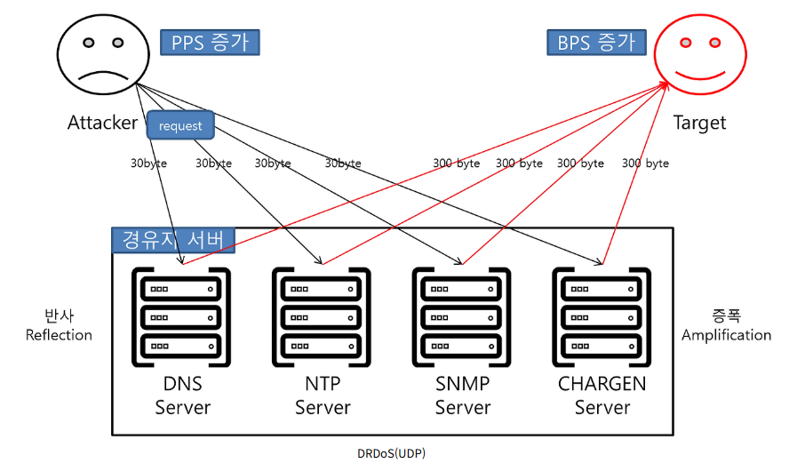

- UDP DRDoS : UDP Protocol 기반의 서비스를 이용하여, 반사(Reflection)와 증폭(Amplification) 공격 형태로 나타나며, 출발지 IP를 Spoofing, UDP 기반 서버에 대규모 요청을 전송하여 반사 시도, 이때 반사된 응답은 증폭되어 공격 대상에게 전달됨

|UDP DRDoS 유형|설명|
|:---|:---|
|DNS Amplification|`DNS 서버에 많은 양의 레코드 정보를 요구하는 DNS 질의 타입(ANY, TXT등)을 요청하여 공격 대상에게 대량의 트래픽(증폭)을 유발`|
|NTP Amplification|`NTP 서버에 최근 접속한 클라이언트 목록(monlist 명령)을 요청하여 대량의 응답 트래픽(증폭)을 유발`|
|SNMP Amplification|`SNMP agent에 MIB와 같은 정보를 대량 요청(GetBulkRequest)하여 공격 대상자에게 대량 트래픽을 유발`|
|CHARGEN Amplification|`CHARGEN 접속 시, 대량의 문자열을 전송하여 공격 대상자에게 대량 트래픽을 유발`|

- TCP DRDoS : 공격자는 출발지 IP를 공격 대상 IP로 Spoofing, 대량의 SYN 패킷을 반사서버로 전송, 반사 서버들은 공격 대상으로 SYN+ACK를 대량 전송하여 서비스 거부 상태 유발

- 일반 DoS와 DRDoS 차이점

|차이점|설명|
|:---|:---|
|공격 근원지 파악의 어려움|`출발지 IP Spoofing 및 수많은 반사 서버를 경유하여 근원지 파악이 매우 어려움`|
|좀비 PC 공격 트래픽 효율 증가|`반사 시도 후, 증폭되어 반환 ex) 반사 서버는 syn+ack 패킷에 대한 응답이 없을 경우, 일정 횟수 재전송을 수행`|

- DRDoS 대응 방안

|대응 방안|내용|
|:---|:---|
|Ingress Filtering|`ISP에서 위조 패킷이 망에 인입되지 않도록 직접 차단`|
|ICMP Protocol 차단|`ICMP 악용 방지를 위해, 사용하지 않을 시, 해당 프로토콜 차단`|
|DNS 서버 점검|`공개용이 아닌, 내부 사용자용 DNS(Resolving) 서버라면, 내부 사용자 주소만 Recursive Query가 가능하도록 제한- F/W, 네트워크 보안 장비 등을 통해 특정 Byte이상 DNS 질의에 대한 응답 차단- 동일 IP에 대해 단위 초당 요청 개수 제한(Limit) 설정`|
|NTP 서버 점검|`monlist 명령(NTP 서버에 최근 접속한 클라이언트 정보를 전송)을 해제 또는 NTP 설정 파일을 통해 해당 기능 비활성화 ex) ntpdc -c monlist <ntp 서버 주소>`|

---

### DNS

#### 1. Master DNS 서버

- /etc/named.conf

```shell
zone "ns.korea.co.kr" IN {
  type (master);
  file "ns.korea.co.kr.zone";
  allow-update {192.168.2.53}
}
```

#### 2. Slave DNS 서버

- /etc/named.conf

```shell
zone "ns.korea.co.kr" IN {
type (slave);
file "slave/ns.korea.co.kr.zone";
masters {192.168.1.53}
allow-update { none }
}

options {
version "unknown"; → 버전 정보를 숨긴다.
directory "/var/named"; → 설정파일들의 위치를 지정한다.
pid-file "/var/run/named.pid"; → named의 프로세스 ID를 기록한 파일 위치이다. 
allow-transfer {192.168.0.1;} → Zone을 전송할 Seconday DNS 서버 IP이다
}
```

#### [DNS 터널링(DNS 프로토콜을 사용하여 임의 데이터를 송수신하는 기술)](https://core-research-team.github.io/2020-05-01/DNS-Tunneling)

- **예시:**

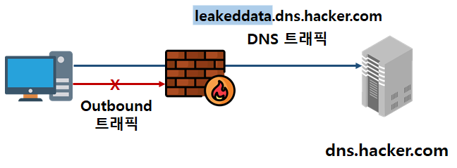

> 일반 DNS 요청:www.google.com → 8.8.8.8 (정상적인 IP 요청)
악성 DNS 요청:secretdata123.attacker.com이 경우 secretdata123는 인코딩된 파일 일부 혹은 명령이고, attacker.com은 공격자의 도메인입니다.
→ 결국 내부 데이터를 공격자의 C2 서버로 DNS 요청을 가장해 보내는 것입니다.

#### [DNSSEC(DNS Security Extensions)](https://한국인터넷정보센터.한국/jsp/resources/dns/dnssecInfo/dnssecProcess.jsp)

- DNS 데이터 대상의 "데이터 위조-변조 공격"을 방지하기 위한 인터넷 표준기술

### [SNORT](https://maker5587.tistory.com/24)

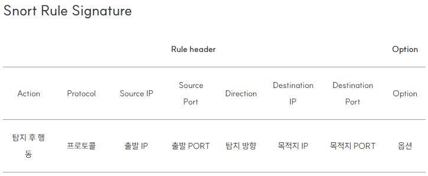

```shell
alert tcp any any -> any 80 (msg:"SQL injection";content:"'1'='1";nocase;sid:1000001;)
alert tcp ![111.111.111.0/24,192.168.1.0/24] any -> [111.111.111.0/24,192.168.1.0/24] 123
# 111.111.111.0/24 또는 192.168.1.0/24 를 제외하고 tcp 프로토콜을 사용해 목적지 123번 포트로 패킷이 들어올 경우 경고를 발생이라는 젇책
```

### [iptables(리눅스 커널 방화벽)](https://meongj-devlog.tistory.com/127)

```shell
iptables [-t table][action][chain][match][-j target]
# iptables -F →  현재 설정되어 있는 iptables의 규칙(rule)을 전부 제거
# iptables -P INPUT DROP → 들어오는 모든 패킷을 거부한다
# iptables -A INPUT -s 192.168.5.13 -j ACCEPT → IP주소가 192.168.5.13인 호스트로부터 들어오는 패킷을 허가한다
```

- 체인(chain) : INPUT(입력패킷 제어), OUTPUT(출력 패킷 제어), FORWARD(통과하는 모든 패킷을 필터링)
- target : ACCEPT, DROP, LOG, REJECT, RETURN

---

## 3. 애플리케이션 보안

### FTP

#### 1. Active Mode

- 명령어 : 21번,  데이터 전송 : 20번

#### 2. Passive Mode

- 명령어 : 21번,  데이터 전송 : 서버가 1024 포트 이후 번호로 설정

#### 3. 기타

- **바운스 공격**
  - **익명사용자**를 이용해서 **포트스캐닝**을 하고 **Fake 메일**을 발송
- 로그파일 : xferlog
- tftp : 69번 UDP, Secure mode로 운영해야 함

---

### 데이터 베이스 보안

#### 1. 기본 계정의 패스워드, 정책등을 변경

```sql
alter user username identified by new_passwd; --Oracle
update user set password=password('new password') where user='root'; --MySQL
```

#### 2. 데이터 베이스의 불필요 계정을 제거하거나, 잠금설정 후 사용

```sql
DROP USER '삭제할 계정'; --Oracle
delete from user where user='삭제할 계정'; --MySQL
```

#### 3. 패스워드의 사용기간 및 복잡도를 기관 정책에 맞도록 설정

```sql
alter profile limit password_life_time xx; 
create profile grace_5 limit; 
```

> FAILED_LOGIN_ATTEMPS 3 (패스워드 실패 3번 까지만 가능)
> PASSWORD_LIFD_TIME 30 (30일 동안만 패스워드 사용 가능)
> PASSWORD_REUSE_TIME 30 (사용한 패스워드 30일 후부터 재 사용 가능)
> PASSWORD_VERIFY_FUNCTION verify_function
> PASSWORD_GRACE_TIME 5 ; (life time이 끝나고 5일 동안 메시지를 보여줌)

#### 4. 원격에서 DB서버로의 접속 제한

```sql
alter system set remote_os_authent=false; --Oracle
delete from user where host='%'; --MySQL
```

#### 5. DBA 이외의 인간되지 않은 사용자가 시스템 테이블에 접근할 수 없도록 설정

```sql
revoke all on mysql.user from '[user name]'@'[hosts]';
```

#### 6. 리스너의 패스워드를 설정하여 사용

```shell
lsnrctl> change_password;
```

#### 7. 응용프로그램 또는 DBA 계정의 Role이 Public으로 설정되지 않도록 설정

```sql
select granted_role from dba_role_privs where grantee='PUBLIC';
```

#### 8. os_roles, remote_os_authentication, remote_os_roles를 false로 설정

> - OS_ROLES : OS 그룹에 의한 사용자의 롤 부여를 가능하게 할지를 설정
> - REMOTE_OS_AUTHENT : 원격지의 OS 인증 허용여부를 설정
> - REMOTE_OS_ROLES : OS가 원격 클라이언트에 대한 롤을 지정할수 있게 할지를 설정

#### 9. 일정 횟수의 로그인 실패시 이에 대한 잠금정책 설정

```sql
alter profile limit failed_login_attempts xxx;
```

### 모바일 보안(BYOD : Bring Your Own Device)

|보안기술|설명|
|:---|:---|
|MDM|Mobile Device Management, `모바일 기기를 원격으로 관리하고 모니터링`|
|컨테이너화|`업무와 관련된 데이터와 애플리케이션을 분리해서 접근`|
|모바일가상화|`하나의 모바일 기기에서 여러 운영체제 및 환경을 실행`|
|MAM|Mobile Application Management, `애플리케이션을 통제 관리`|

### 보안도구

|도구|설명|
|:---|:---|
|Tripwire|`무결성 점검도구, 오픈소스기반 HIDS`|
|Jonh the ropper|`패스워드 크랙을 위한 도구`|
|Nessus|`클라이언트/서버구조로 취약점 검사`|
|Nikto|`공개용 웹취약점 도구`|
|Rookit|`존재를 숨기면서, 권한획득 백도어 기능을 수행하는 프로그램의 집합`|
|COPS|`시스템 내부에 존재하는 취약점 점검도구, UNIX`|
|SAINT|`원격 취약점 점검도구, UNIX`|
|SARA|`SATAN을 기반으로 개발된 취약점 분석도구, UNIX`|
|YARA|Yet Another Recursive Acronym, `악성코드 분석을 할때 시그니처 탐지룰에 활용, 패턴 기반 탐지에서 강력하며, 규칙 기반의 언어로 정의된 규칙을 통해 사용자가 정교한 탐지 규칙을 생성하고 활용`|

---

## 4. 정보보안 일반

### 암호문 공격기법 4가지를 설명

|공격기법|설명|
|:---|:---|
|Ciphertext Only Attack|`암호문 C를 갖고, 평문 P나 Key를 찾아내는 방법(통계적 성질, 문장의 특성을 추정하여 해독)`|
|Known Plaintext Attack|`일정량의 평문 P를 통해 암호문 C를 알고 있는 상태에서, 암호문 C와 평문 P의 관계로부터 KEY나 평문 P를 추정하여 해독`|
|Choosen Plaintext Attack|`사용된 암호기에 접근 가능하여, 평문 P를 선택하여 암호문 C를얻어 Key와 평문 P를 추정하여 암호를 해독하는 방법`|
|Choosen Ciphertext Attack|`복호기에 접근 가능하여, 암호문 C를 선택하여 평문 P를 얻어 암호를 해독하는 방법`|

---

### 커버로스(Kerberos)란?

- **티켓 기반**의 컴퓨터 **네트워크 인증 암호화 프로토콜**
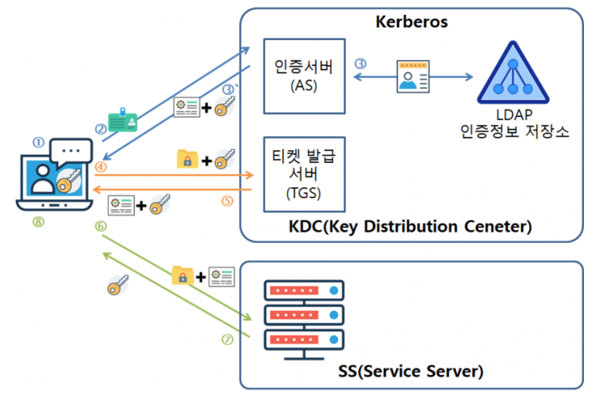

  - 클라이언트: 인증을 얻길 원하는 사용자의 컴퓨터
  - 서버: 클라이언트가 접근하려고 하는 컴퓨터
  - 인증서버: 클라이언트를 인증해주는 컴퓨터
  - 티켓 발급 서버: 티켓을 클라이언트에게 발급해주는 서버
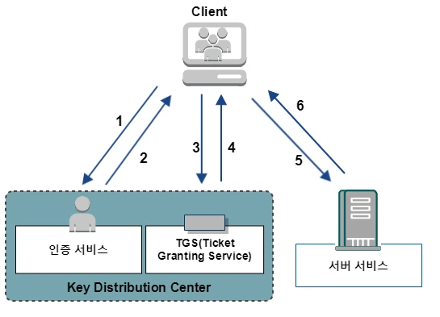

> 1. 사용자는 인증서비스에 인증
> 2. 인증서비스는 사용자에게 시작 티켓을 전송
> 3. 사용자는 서비스 접근 요청
> 4. TGS는 세션키가 포함된 새로운 티켓을 만든다
> 5. 사용자는 하나의 세션키를 추출하고 티켓을 파일 서버로 전송
> 6. 티켓을 받은 서버는 사용자에게 대한 서비스 제공여부 결정

### 국내 암호화 기술

- SEED: 128bit 대칭키
- ARIA: SPN 구조
- HIGHT: RFID, USN, 저전력
- LEA: 빅데이터, 클라우드
- LSH: 해시함수

### [암호화 알고리즘 종류와 분류](https://velog.io/@inyong_pang/Programming-암호화-알고리즘-종류와-분류)

- [암호화 알고리즘 종류](https://danyoujeong.tistory.com/221)


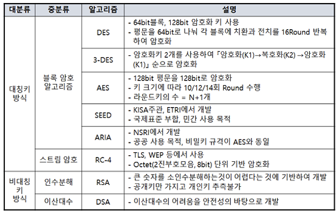

- 단방향 Hash 알고리즘

| 알고리즘 | MD 길이 | 블록 길이 | 최대 메시지 길이 |
|:---:|:---:|:---:|:---:|
| MD5 | 128bit | 512bit | 무한 |
| SHA-1 | 160bit | 512bit | 2^64-1bit |
| SHA-224 | 224bit | 512bit | 2^64-1bit |
| SHA-256 | 256bit | 512bit | 2^64-1bit |
| SHA-384 | 384bit | 1024bit | 2^128-1bit |
| SHA-512 | 512bit | 1024bit | 2^128-1bit |

| 알고리즘 | 해시값 크기 | 내부 상태 크기 | 블록 크기 | 길이 한계 | 워드 크기 | 과정수 | 사용되는 연산 | 충돌 |
|:---:|:---:|:---:|:---:|:---:|:---:|:---:|:---:|:---:|
| SHA-0 | 160 | 160 | 512 | 64 | 32 | 80 | +,and,or,xor,rotl | 발견됨 |
| SHA-1 | 160 | 160 | 512 | 64 | 32 | 80 | +,and,or,xor,rotl | 발견됨 |
| SHA-256/224 | 256/224 | 256 | 512 | 64 | 32 | 64 | +,and,or,xor,shr,rotr | - |
| SHA-512/384 | 512/384 | 512 | 1024 | 128 | 64 | 80 | +,and,or,xor,shr,rotr | - |

### [PKI](https://danyoujeong.tistory.com/222)

#### PKI 구성

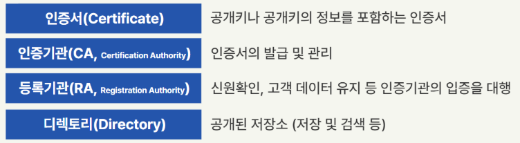

---

### 접근 통제 모델

- MAC(Mandatory Access Control) : 강제적 접근통제,  **보안등급**, **규칙기반** 접근 통제
- DAC(Dicrentionary Access Control) : 임의적 접근통제, **신원기반**, **사용자기반**, **혼합방식** 통제
- RBAC(Role-Based Access Control) : 역할기반 접근통제, **직무**를 기반으로 하는 접근통제

### 접근 통제 보안 모델

||ss-property|*-property|
|:-|:-:|:-:|
|Bell-Lapadula|`No Read Up`|`No Write Down`|
|Biba|`No Read Down`|`No Write Up`|

---

## 5. 정보보안관리 및 법규

### 위험관리 구성

|구성요소|설명|
|:--|:---|
|위험|`위협, 취약점을 이용하여 자산에 손실, 피해를 가져올 가능성`|
|위협|`자산에 악영향을 줄수 있는 사건 및 행위`|
|취약점|`위협이 발생하기 위한 조건이나 상황`|
|자산|`조직이 보호해야 할 대상`|

### CC(Common Criteria, ISO15408) : CCRA 가입국간의 정보보호제품에 대한 상호인증

|구성요소|설명|
|:---|:---|
|PP`(Protect Profile)`|`특정 고객의 요구를 충족시키는 제품의 기능성, 보증 요구사항의 집합`|
|ST`(Security Target)`|`보안목표명세서, 기능성과 보증 관련 요구사항을 포함한 제품의 명세서, 벤더작성`|
|TOE`(Target of Evaluation)`|`평가 대상 시스템이나 제품`|
|EAL`(Evaluation Assurance Level)`|`평가보증등급, EAL1~EAL7`|

---

### 정량적 위험분석과 정성적 위험분석

|구분|정량적 위험분석|정성적 위험분석|
|:---|:---|:---|
|개념|`ALE(연간기대손실)=SLE(위험발생확률)xARO(손실크기)`|`손실크기 표현 어려움`|
|기법|`연간손실액, 과거자료, 수학`|`전문가감정, 기준선법(체크리스트), 시나리오법`|

- DoA(수용가능한 위험수준)   :  인터넷 → 차단 3,2=6  > 4  = 위험 감소

---

### ○ 정보보호 최고 책임장의 역할 및 책임

1. 정보보호 **관리체계 수립 및 관리/운영**
2. 정보보호 **취약점 분석/평가 및 개선**
3. **침해사고 예방 및 대응**
4. **사전 정보보호대책 마련** 및 **보안조치 설계/구현** 등
5. 정보보호 **사전 보안성 검토**
6. 중요 정보의 **암호화 및 보안서버** 적합성 검토

---

### ○ 개인정보 동의 시 정보주체에게 알리고 동의 받아야 할 항목

1. 개인정보의 **수집·이용 목적**
2. 수집하려는 개인정보의 **항목**
3. 개인정보의 **보유 및 이용 기간**
4. 동의를 거부할 권리가 있다는 사실 및 동의 거부에 따른 불이익이 있는 경우에는 그 불이익의 내용

---

### ○ 개인정보 영향평가 시에 고려 사항 4가지

1. 처리하는 개인정보의 **수**
2. 개인정보의 **제 3자 제공 여부**
3. 정보주체의 **권리를 해할 가능성 및 그 위험 정보**
4. 그밖에 대통령으로 정하는 사항

---

### ○ 개인정보 안전성 확보조치

1. 내부관리 계획
2. 접근권한 관리  (권한 차등부여, 퇴직 및 직무 변경시, 권한변경 3년간 기록, 권한변경 검토 )
3. 접근통제  (인가된자만 접근 → 안전한접속수단(vpn등) or 안전한 인증(2factor 인증))
4. 접속기록       (5만건 미만 1년간 보관, 이상 2년간, 개인정보취급자가 개인정보시스템에 접근한것 접속지 IP, 접속일시,계정,수행업무,정보주체정보 기록 ) 매월검토
5. 개인정보 암호화 (고유식별자 4개 -신용카드/계좌번보/생체인식정보), 생체인식정보/비밀번호 → 단방향암호화
6. 물리적 보안
7. 개인정보 파기 (목적 달성시 지체없이(5일) 파기)

---

- 쇼단(shodan) : http://shodanhq.com (551p)
- 특정 서버에 주기적으로 의심스러운 중국IP로 접속한 사실을 확인

```shell
netstat -anp | grep "중국 IP"
```

- /etc/passwd에 root 권한 있는 사용자 확인
- lastcomm으로 acct/pacct 파일 내용 확인
