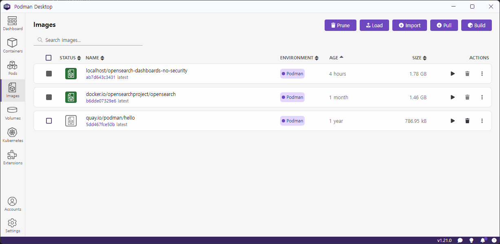
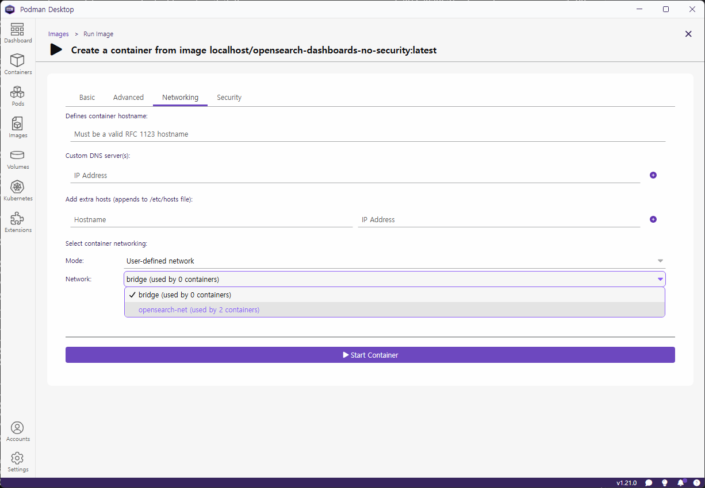

# AWS Gen AI Sandbox

## 참가

### 1. [AWS]()

#### 프로젝트 정보(Bedrock 지식기반 - 사업장 탄소배출 )

* [프로젝트 명] : GLOESG(Global ESG)
* [개발 목적]

> ???

* [프로젝트 소개]

> ???

* [기대효과]

> ???

### 2. [Opensearch PC 설치](https://kugancity.tistory.com/entry/윈도우에서-opensearch-사용하기#google_vignette)

* podman desktop 에서 image pull 함
* 
* image 실행 시킬때 아래와 같이 입력
  - name : opensearch-node
  - 환경변수 셋팅
```shell
podman run -d --name opensearch-node -p 9200:9200 -e "discovery.yype=single-node" -e "plugins.security.disabled=true" -e "OPENSEARCH_INITIAL_ADMIN_PASSWORD=xxxxxxxxxxxxx" 
```

* [WSL에서 로그인 없이 접근 가능한 OpenSearch 환경을 만듬](https://docs.opensearch.org/latest/security/configuration/disable-enable-security/)

```shell
# 오픈 서치 Dashboard랑 같은 네트워크를 위해 wsl에서 아래와 같이 함
PS C:\Users\Administrator>podman network create opensearch-net
$ wsl
[user@DESKTOP-V3J1TMP ~]$ mkdir popensearch
[user@DESKTOP-V3J1TMP ~]$ cd popensearch/
# opensearch_dashboards.yml 편집함
[user@DESKTOP-V3J1TMP popensearch]$ vi opensearch_dashboards.yml
---
server.name: opensearch-dashboards
server.host: "0.0.0.0"
opensearch.hosts: http://localhost:9200
# Dockerfile 편집함
[user@DESKTOP-V3J1TMP popensearch]$ vi Dockerfile
FROM opensearchproject/opensearch-dashboards:3.2.0
RUN /usr/share/opensearch-dashboards/bin/opensearch-dashboards-plugin remove securityDashboards
COPY --chown=opensearch-dashboards:opensearch-dashboards opensearch_dashboards.yml /usr/share/opensearch-dashboards/config/
[user@DESKTOP-V3J1TMP popensearch]$ podman build --tag=opensearch-dashboards-no-security .
# PC Podman Desktop에 등록하려고 tar 파일로 만들어서 EXPORT 함,  아래  DOCKER HUB에 등록 하고 거기서 가져오도록 하는것이 더 좋아보임
[user@DESKTOP-V3J1TMP popensearch]$ podman save -o opensearch-dashboards.tar localhost/opensearch-dashboards-no-security:latest
# DOCKER HUB에 등록
[user@DESKTOP-V3J1TMP popensearch]$ podman login docker.io
Username: shpimit
Password:
Login Succeeded!
[user@DESKTOP-V3J1TMP popensearch]$ podman tag ab7d643c3431 docker.io/shpimit/opensearch_dashboards:opensearch-dashboards-no
-security
```

* [OpenSearch Dashboard 설치]

```shell
docker run -d --name opensearch-dashboards --net opensearch-net -p 5601:5601 \
  -e "OPENSEARCH_HOSTS=[\"http://opensearch-node:9200\"]" \
  opensearchproject/opensearch-dashboards:latest
  -v osdvolume: /usr/share/opensearch-dashboards
  OPENSEARCH_INITIAL_ADMIN_PASSWORD Prugio!03
  opensearch.hosts http://opensearch-node:9200
```

* podman desktop 에서 network 위에서 셋팅한 opensearch-net 선택하고 실행함.
* 

## Reference

* [Podman Desktop](https://lifeplan-b.tistory.com/311)
* [Opensearch Dashboard](https://coding-today.tistory.com/165)